#  Transfer Legacy – System Design & Security Documentation

---

## 1. Introduction

### 1.1 Background & Motivation

Today, people manage sensitive digital assets — bank logins, crypto wallets, identity documents, medical credentials. If the account holder dies or becomes incapacitated, these assets risk being lost forever. Traditional solutions (lawyers, paper notes, password managers) either fail at **security** (easy to leak) or at **usability** (difficult to retrieve for beneficiaries).

**Inheritance Vault** solves this by combining:

- **Zero-Knowledge encryption** → server never sees plaintext.
    
- **Post-Quantum cryptography** → assets remain safe for decades.
    
- **Heartbeat-based liveness detection** → ensures assets are only released after verified inactivity.
    
- **m-of-n beneficiary approval** → prevents fraud and enforces legal workflows.
    

👉 **Why this matters:** Existing password managers (LastPass, 1Password) don’t natively handle inheritance flows. Some crypto wallets offer recovery, but not across heterogeneous secrets (bank + crypto + IDs). Our system uniquely covers _all digital secrets_ with legal & cryptographic guardrails.

---

### 1.2 Problem Statement

We need a secure, scalable, legally-defensible system where:

1. A user can safely store sensitive data (wallet keys, login details, personal notes).
    
2. Upon death/inactivity, these secrets are released **only** after:
    
    - Pre-chosen beneficiaries verify themselves.
        
    - Legal verification (death certificate, optional lawyer involvement).
        
    - A quorum (m-of-n) approval is met.
        
3. At no point does the server or an attacker gain plaintext access.
---
### 1.3 Goals

- **Security**: Use state-of-the-art cryptography (XChaCha20, Argon2id, PQ-safe KEM).
    
- **Zero-Knowledge**: Server only stores ciphertext; decryption only on client.
    
- **Inheritance logic**: Automated but human-verifiable (lawyers, conflict resolution).
    
- **Cross-platform**: Web app, mobile app, browser extension.
    
- **Scalable infra**: Start cost-effective (Vercel + MongoDB Atlas), migrate to enterprise-ready stack when needed.
    
- **Compliance**: GDPR-compliant, legally defensible audit trail.
    
---

### 1.4 Non-Goals

- Acting as a bank, financial custodian, or executor of estates.
    
- Automatic validation of death certificates (always requires manual/legal check).
    
- Providing plaintext export APIs (strict client-only decryption).
    
---

## 2. Requirements

### 2.1 Functional Requirements

1. **User Authentication**
    
    - Must support email + password + mandatory 2FA.
        
    - Optionally support 3rd factor (TOTP or SMS).
        
    - Recovery via backup key or 2-of-3 verifications.
        
2. **Secret Storage**
    
    - Secrets encrypted on client with AEAD (XChaCha20-Poly1305).
        
    - Stored envelopes per secret → each beneficiary gets a wrapped key.
        
3. **Beneficiary Setup**
    
    - Owner designates beneficiaries by email.
        
    - If user already exists → reuse account.
        
    - If not → invite via email, minimal onboarding required.
        
    - Owner chooses inheritance policy (who gets what, with what quorum).
        
4. **Heartbeat & Liveness**
    
    - User selects heartbeat interval (1w, 15d, 1m, 3m).
        
    - Grace period proportional to interval.
        
    - Missed heartbeats trigger notifications → then claim window.
        
5. **Inheritance Flow**
    
    - Beneficiaries notified after inactivity.
        
    - Must provide documents (ID, death certificate).
        
    - Approval requires m-of-n quorum.
        
    - Optional lawyer involvement.
        
    - Conflict resolution: internal review team escalates to legal if multiple claims.
        
6. **Audit & Logging**
    
    - Every event (heartbeat, claim, approval, rejection) logged.
        
    - Logs signed by KMS for tamper-evidence.
        
7. **Browser Extension**
    
    - Autofill credentials locally.
        
    - Never transmits plaintext.
        

---

### 2.2 Non-Functional Requirements

- **Security**: Zero-Knowledge, post-quantum safety.
    
- **Scalability**: 10x user growth handled by MongoDB sharding + serverless scaling.
    
- **Availability**: 99.9% uptime target.
    
- **Latency**: Sub-200ms response for secret retrieval.
    
- **Cost efficiency**: < $1 per user/month infra cost at MVP scale.
    
- **Portability**: Migratable from Vercel to Kubernetes, Mongo to other DBs.
    

---

### 2.3 Stakeholders

- **Owner (primary user)**: stores secrets, configures inheritance.
    
- **Beneficiaries**: designated recipients of secrets.
    
- **Lawyer (optional)**: legal verifier of claims.
    
- **System Operators**: maintain uptime, monitor fraud, manually resolve conflicts.
    

---

## 3. Architecture Overview

### 3.1 System Components

- **Clients**: Web app, mobile app, browser extension (all crypto local).
    
- **API Backend (Vercel Functions)**: Authentication, orchestration, notifications.
    
- **Workers (AWS ECS/Lambda)**: Handle async jobs (heartbeat, email).
    
- **Database (MongoDB Atlas)**: Store ciphertexts, policies, user states.
    
- **Storage (S3)**: Store large encrypted files (certificates, attachments).
    
- **KMS/HSM**: Used for signing audit logs, not for user keys.
    

---

### 3.2 High-Level Flow

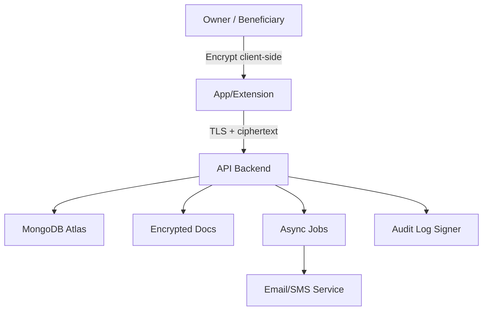
# Data Flow & Full Diagram Set (DFD, Sequence, ERD, Component, Deployment, State Machine)

## DFD — Level 0 (context)

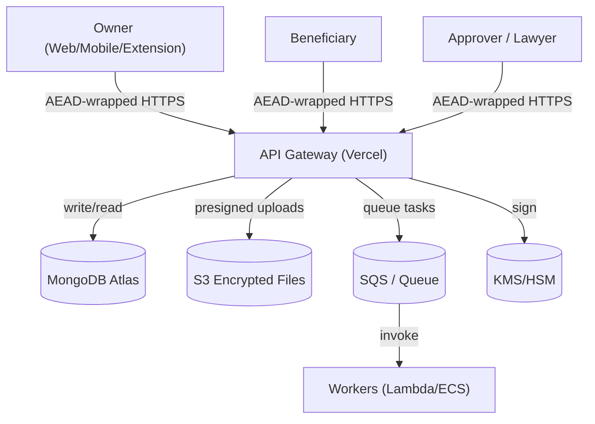

**Explanation & Implementation notes**

- All clients communicate via TLS to the API; additionally they AEAD-wrap sensitive payloads (app-layer AEAD) as described in Chunk 1.
    
- Mongo stores documents (users, items, shares, policies, claims, attestations, audit).
    
- S3 stores large encrypted binaries (death certificates, attachments). Clients MUST encrypt attachments locally before upload; server only stores ciphertext.
    
- SQS decouples worker tasks (heartbeat evaluation, notifications, release tasks). Workers are idempotent and use DLQs for failures.
    
- KMS/HSM only used for signing audit snapshots & release_records — never used to decrypt user secrets.
    

---

## DFD — Level 1 (detailed flows)

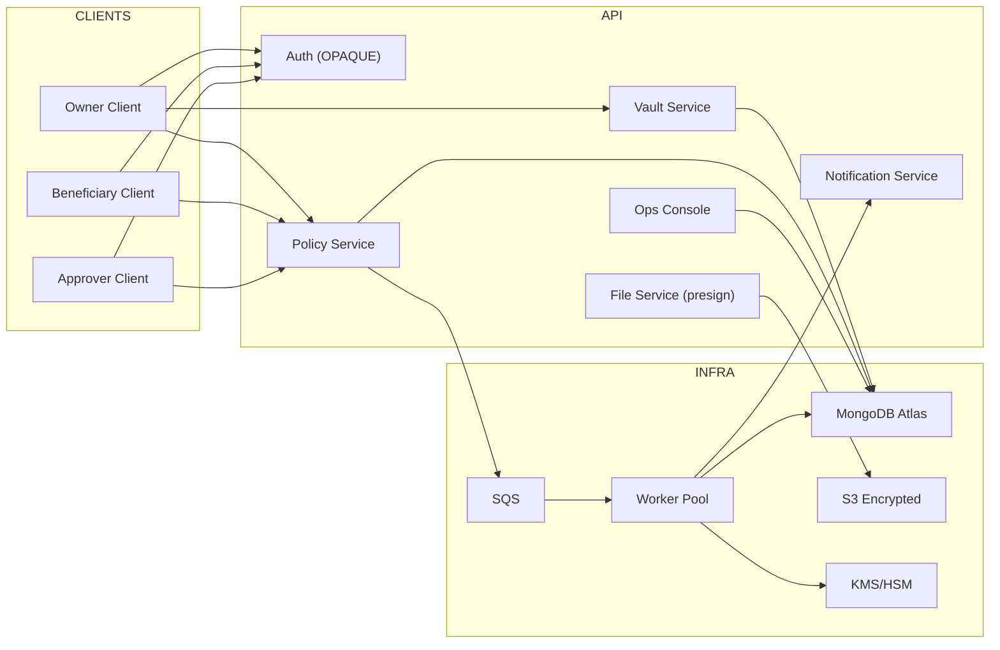

**Explanation**

- Auth handles registration/login via OPAQUE; Vault handles items & shares; Policy handles inheritance policy lifecycle; File service returns presigned upload URLs.
    
- Workers process queued tasks for heartbeat, release checks, conflict detection, and audit anchoring. Workers ask KMS to sign release records and daily audit heads.
    

---

## Sequence Diagrams — Full flows

### 1) Registration & Login (OPAQUE) — client + server

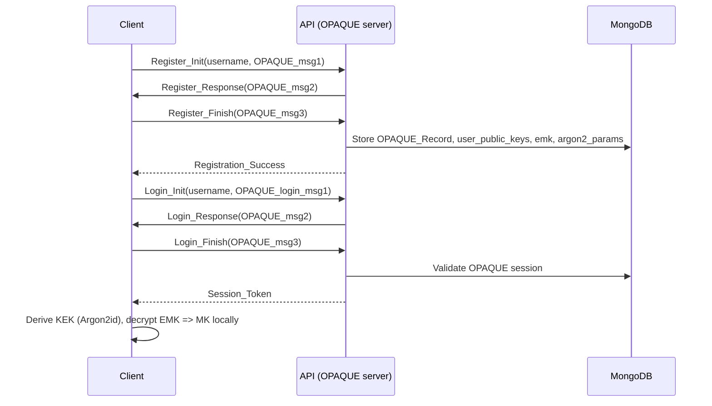

**Notes**

- Server never receives plaintext password nor password-equivalent verifier. OPAQUE protects against offline dictionary attacks.
    
- Client stores MK locally (possible in secure enclave or device storage).
    
- `emk` saved in DB is AEAD(KEK, MK).
    

---

### 2) Create Item & Prewrap (owner prewraps IK for beneficiaries)

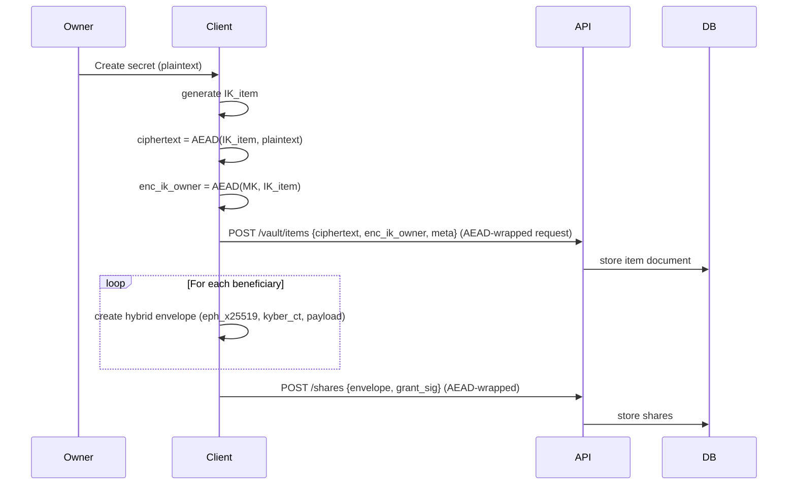

**Notes**

- Prewrapping is done client-side to avoid server ever seeing IK in plaintext. Shares are stored on DB as ciphertext envelopes.
    
- Owner signs the share envelope with Ed25519 to show intent.
    

---

### 3) Heartbeat lifecycle & escalation (owner inactivity detect)

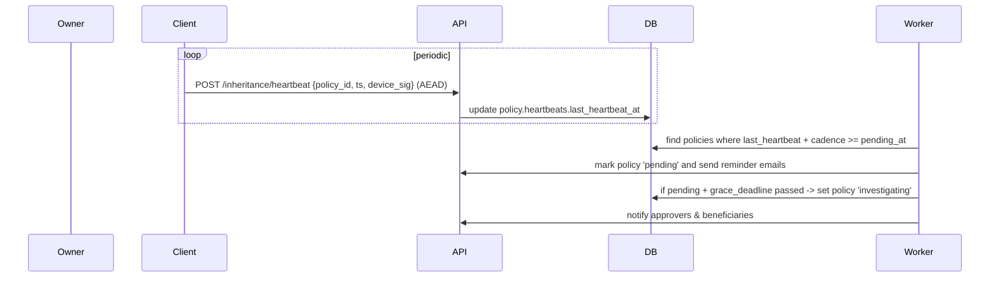

**Notes**

- Heartbeats are signed by device key (Ed25519) for authenticity.
    
- Worker scheduling: run hourly; ensure idempotency.
    

---

### 4) Claim Initiation & Document Upload

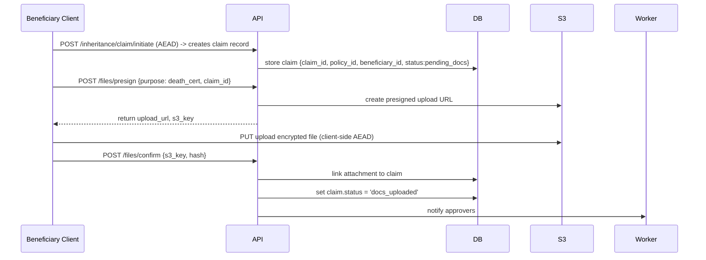

**Notes**

- Client must encrypt files locally before S3 upload; server still requires hash to validate upload integrity.
    
- Use short presign TTL and require content hash to be posted.
    

---

### 5) Approver Attestation Submission

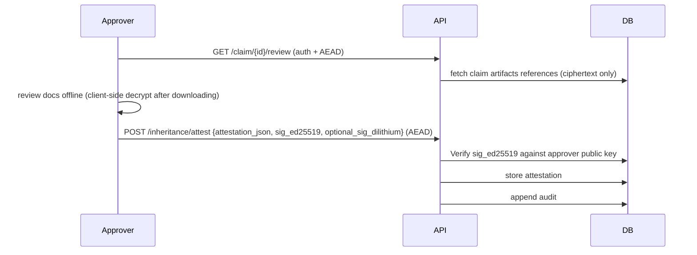

**Notes**

- Attestation must be canonical JSON signed by approver. Server verifies signatures and stores the attestation entry.
    

---

### 6) Release creation, conflict hold, delivery

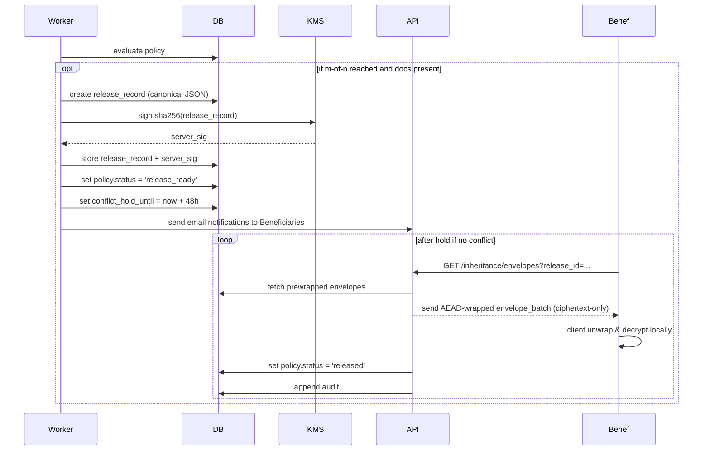

**Notes**

- Release is not executed until conflict_hold expires and no conflicts are unresolved. If conflicts occur, escalate to manual review.
    

---

### 7) Conflict detection & manual resolution

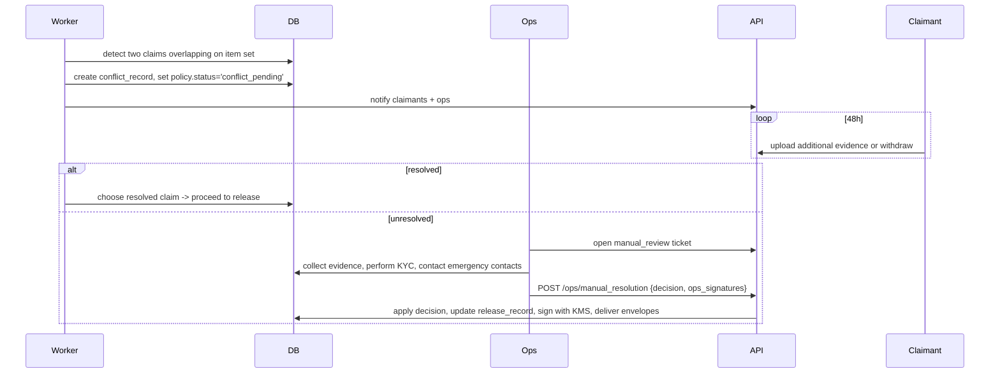

**Notes**

- Manual resolution requires two ops signatures and is fully logged in the audit chain.
    

---

## ERD — Expanded with collection fields & sample indices

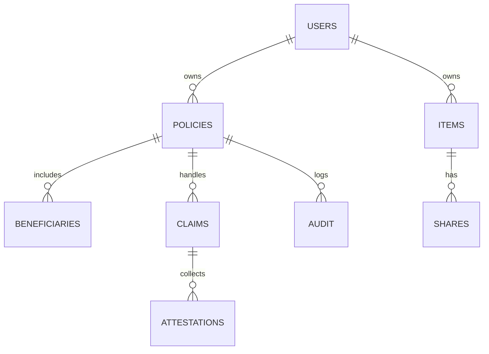

### Collection field summaries (complete)

**users**

- `_id` (string, "u_") — primary
    
- `email` (string) — unique index
    
- `legal_name` (string, may be encrypted)
    
- `public_keys`:
    
    - `x25519` (BASE64)
        
    - `kyber768` (BASE64)
        
    - `ed25519` (BASE64)
        
    - `dilithium2` (BASE64, optional)
        
- `emk` — `{ version, nonce, ct }`
    
- `argon2_params` — { m, t, p, salt }
    
- `devices` — array of device records with emk_device
    
- `created_at`
    

**items**

- `_id` (string)
    
- `owner_id` (ref users)
    
- `ciphertext` (BASE64)
    
- `nonce` (BASE64)
    
- `enc_item_key` (owner-wrap)
    
- `meta` (title_hash, type)
    
- `created_at`
    
- indexes: `owner_id`, `meta.type`
    

**shares**

- `_id`
    
- `item_id`
    
- `granter_id`
    
- `grantee_id`
    
- `enc_ik_for_grantee` (envelope JSON)
    
- `grant_sig` (ed25519, optional dilithium)
    
- `created_at`
    
- validator enforces envelope structure
    

**policies**

- `_id`
    
- `owner_id`
    
- `status` (active|pending|investigating|release_ready|conflict_pending|manual_review|released)
    
- `cadence` (1w|15d|1m|3m)
    
- `m_of_n` { m, n }
    
- `beneficiaries` array
    
- `approvers` array
    
- `heartbeats` { last_heartbeat_at, pending_at, grace_deadline }
    
- `attachments`
    
- `audit_head_hash`
    
- indexes: `owner_id`, `status`
    

**claims**

- `_id`
    
- `policy_id`
    
- `beneficiary_id`
    
- `status` (pending_docs|docs_uploaded|attestations_pending|ready)
    
- `attachments` -> s3 keys
    
- `created_at`
    
- indexes: `policy_id`, `beneficiary_id`
    

**attestations**

- `_id`
    
- `policy_id`
    
- `claim_id`
    
- `attestor_id`
    
- `attestation_hash`
    
- `sig_ed25519`
    
- `sig_dilithium2` (optional)
    
- `meta` (kyc provider)
    
- `created_at`
    

**audit**

- `_id`
    
- `policy_id`
    
- `actor`
    
- `event_type`
    
- `payload_hash`
    
- `prev_hash`
    
- `hash`
    
- `ts`
    
- append-only
    

**conflicts**

- `_id`
    
- `policy_id`
    
- `items` array
    
- `claims` array
    
- `hold_expires_at`
    
- `status`
    

---

## Component Diagram — service decomposition (detailed)

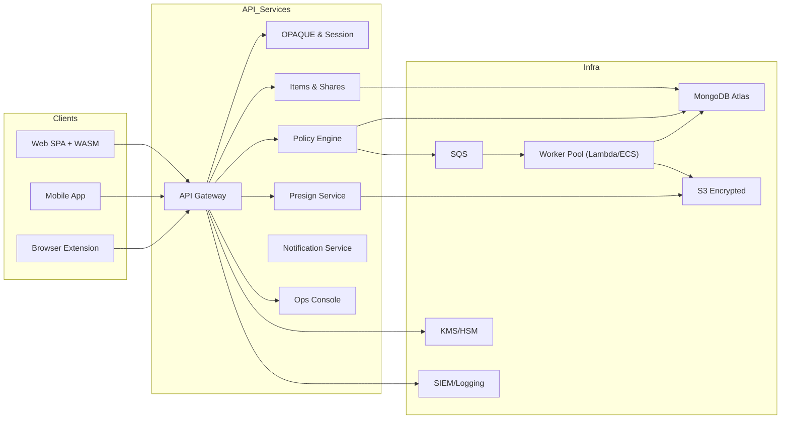

**Responsibilities**

- **Auth**: OPAQUE registration/login, session issuance, device enrollment.
    
- **Vault**: accept AEAD-wrapped item uploads (ciphertext + enc_item_key), store items; accept shares.
    
- **Policy**: store policy objects, heartbeat tracking, state machine transitions.
    
- **Files**: presign URLs for S3, record attachments meta.
    
- **Notify**: email & push scheduling (owner reminder, approver invites, beneficiary notices).
    
- **Workers**: evaluate heartbeats, enforce state transitions, sign release_record with KMS, implement conflict/human review escalations.
    
- **Admin**: ops UI for manual reviews and audit exports.
    

---

## Deployment Diagram — recommended infra & zones

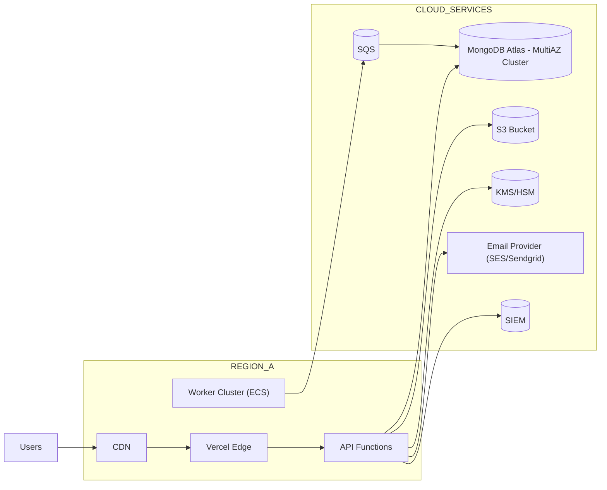

**DR & HA** (Disaster Recovery & High Availability)

- MongoDB Atlas configured for Multi-AZ & daily backups.
    
- S3 with versioning and MFA-delete for critical buckets.
    
- KMS with multi-operator rotation & CloudTrail logging.
    
- Workers in multiple AZs or regions for resiliency.
    

---

## Policy State Machine (detailed)

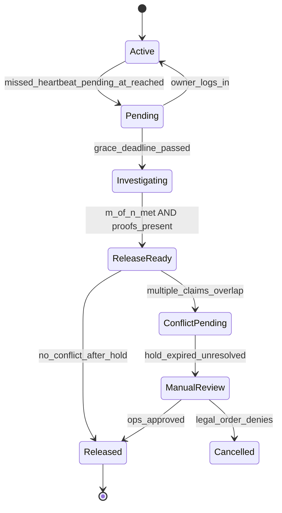

**Timing specifics**

- From Active to Pending: last_heartbeat + cadence period reached.
    
- Pending to Investigating: pending_at + grace period (depends on cadence).
    
- When ReleaseReady: worker signs release_record and starts conflict hold (48h default).
    
- ConflictPending holds before manual review.
    

---

## Diagram Explanations & Developer Notes (practical)

1. **Why separate Vault & Policy services?**
    
    - Vault is data-centric (items, shares) and must be extremely simple (store/retrieve). Policy contains complex business logic (heartbeats, state transitions). Decoupling simplifies scaling & testing and reduces blast radius for secrets.
        
2. **Why worker queue for heartbeats?**
    
    - Heartbeat checks are scheduled and can accumulate. Using a queue makes processing retryable, idempotent, and observable. It also decouples these ops from request latency.
        
3. **Why KMS only for signing?**
    
    - KMS/HSM manages server signing keys for audit anchors and release_record signatures. User secrets remain outside KMS to preserve ZKA. This keeps attestation/audit non-repudiable while minimizing key handling liability.
        
4. **Indexing hints**
    
    - Primary indices: `users.email`, `items.owner_id`, `policies.owner_id, status`, `claims.policy_id`, `attestations.attestor`.
        
    - Worker queries should be served by index on `policies.status` and `policies.heartbeats.pending_at` to avoid full collection scans.
        
---

## 4. Cryptography
### 4.1 Threat Model Assumptions

- **Adversary can**: read the entire server DB, S3 buckets, transport metadata; compromise TLS terminators; phish users; attempt offline brute-force if they obtain local data from a compromised device.
    
- **Adversary cannot**: break modern AEAD (XChaCha20-Poly1305), OPAQUE, X25519, or Kyber-768; read device secure enclave; forge Ed25519 signatures.
    
- **Goal**: Even with full server compromise, secrets remain confidential. Release flows are **tamper-evident** and **non-repudiable** via signatures and audit anchoring.
    

---

### 4.2 Primitive & Version Matrix

|Purpose|Algorithm|Params|Encoding|Version tag|
|---|---|---|---|---|
|Item encryption (AEAD)|**XChaCha20-Poly1305**|24B nonce, 16B tag|`base64url`|`aead-xchacha20p1305-v1`|
|Password KDF|**Argon2id**|per-device (m,t,p), 16–32B salt|raw/B64 in JSON|`argon2id-v1`|
|PAKE|**OPAQUE**|RFC 9380 impl (OPRF Ristretto255)|protocol buffers/JSON|`opaque-v1`|
|Classical ECDH|**X25519**|32B pub/priv|`base64url`|`x25519-v1`|
|PQ KEM|**Kyber-768 (ML-KEM-768)**|NIST PQC|`base64url`|`kyber768-v1`|
|Hybrid KEM wrap|**HKDF-SHA256(X25519||Kyber)**|see §4.7|
|Signatures|**Ed25519** (req’d)|64B sig|`base64url`|`ed25519-v1`|
|PQ Signatures|**Dilithium-2** (optional)|large pk/sig|`base64url`|`dilithium2-v1`|
|Audit hash|**SHA-256**|—|hex|`sha256-v1`|
|Canonicalization|**JCS** (JSON Canonicalization Scheme)|RFC 8785|UTF-8 bytes|`jcs-v1`|

**Why these**: XChaCha (safer nonce model, great in WASM), Argon2id (memory-hard), OPAQUE (password secrecy), hybrid KEM (future-proof confidentiality), Ed25519 (fast, small). See Clarifications for trade-offs.

---

### 4.3 Key Hierarchy & IDs

- `MK` (Master Key, 32B): random, client-generated.
    
- `KEK` (Key Encryption Key): derived via Argon2id(password, salt, params).
    
- `EMK = AEAD(KEK, MK, ad = jcs({owner_id, crypto_version}))`.
    
- `IK_item` (per-item key, 32B random).
    
- `enc_item = AEAD(IK_item, plaintext, ad = item_meta)`.
    
- `enc_ik_owner = AEAD(MK or FK_folder, IK_item, ad = binding_meta)`.
    
- `enc_ik_ben` (envelope): hybrid KEM wrapping IK_item for a beneficiary’s public keys.
    
- Identity keys per user: `x25519`, `kyber768`, `ed25519` (and optional `dilithium2`).
    

**IDs bound into AD** wherever present: `owner_id`, `item_id`, `policy_id`, `crypto_version`, `schema_version`.

---

### 4.4 Password KDF & OPAQUE

#### 4.4.1 Argon2id (KEK derivation)

- **Desktop defaults**: `m=256MB, t=2, p=2`
    
- **Mobile defaults**: `m=64MB, t=2, p=1`
    
- **Salt**: 16–32B random per user device; stored as `argon2_params.salt`.
    
- **Re-wrap policy**: On next login after param change, re-derive KEK and upload new `EMK`.
    
#### 4.4.2 OPAQUE (login)

- Use a vetted OPAQUE library (OPRF Ristretto255).
    
- Server stores **OPAQUE record (verifier)** only.
    
- Flow:
    
    1. **Register**: client & server perform OPAQUE registration; server persists record.
        
    2. **Login**: OPAQUE handshake → session. Then client fetches `EMK`, runs Argon2id to derive KEK, decrypts MK locally.
        
- **Binding**: tie session to device by signing a server-provided nonce with `ed25519` device key on first login.
    

---

### 4.5 App-layer AEAD Transport (over TLS)

**Goal**: Bind request bodies to per-request ephemeral X25519 keys to reduce blast radius if TLS endpoint compromised.

**Client derivation**

1. Generate ephemeral X25519 `(c_eph_sk, c_eph_pk)`.
    
2. Server exposes static `s_x25519_pk`.
    
3. `ss = X25519(c_eph_sk, s_x25519_pk)`.
    
4. `rsk = HKDF-SHA256( ss, salt = jcs({path, ts, user_id, seq}), info="app-transport-v1" )`.
    
5. Encrypt request body: `ct = AEAD_XCHACHA20P1305(rsk, nonce24, body, ad=jcs({path, ts, seq}))`.
    

**HTTP headers**

- `X-Client-Pub: base64url(c_eph_pk)`
    
- `X-TS: RFC3339 UTC`
    
- `X-Seq: monotonically increasing per device`
    
- Body: `{ "nonce":"...", "ct":"..." }`
    

**Server**

- Derive `rsk` using its `s_x25519_sk`.
    
- Validate `ts` (±5 min) and monotonic `seq` per session.
    
- Decrypt; reject on AEAD failure.
    

---

### 4.6 Item Encryption Format

**Canonical item JSON (stored under `items`)**

```json
{
  "schema_version": 1,
  "crypto_version": "aead-xchacha20p1305-v1",
  "owner_id": "u_123",
  "item_id": "it_456",
  "nonce": "B64URL_24B",
  "ciphertext": "B64URL",
  "ad": {
    "type": "password|wallet|note|file_pointer",
    "title_hash": "HEX_SHA256_OF_TITLE",
    "created_at": "2025-08-29T12:00:00Z"
  },
  "enc_item_key_owner": {
    "wrapper": "mk",
    "nonce": "B64URL_24B",
    "payload": "B64URL"
  }
}
```

**Rules**

- `ciphertext = AEAD_XCHACHA20P1305(IK_item, nonce, plaintext, ad = JCS(ad))`.
    
- `enc_item_key_owner.payload = AEAD_XCHACHA20P1305(MK or FK_folder, nonce2, IK_item, ad = JCS({owner_id,item_id}))`.
    
- Nonces: 24 random bytes. Never reuse the same `(key, nonce)` pair. Log and abort on detection.
    

---

### 4.7 Hybrid KEM Envelope (X25519 + Kyber-768)

**Purpose**: Wrap `IK_item` to a beneficiary that has `(pk_x25519, pk_kyber)`.

**Owner→Beneficiary wrap**

1. Generate ephemeral X25519 `(eph_sk, eph_pk)`.
    
2. `ss_classical = X25519(eph_sk, pk_ben_x25519)` → 32B.
    
3. `kyber_ct, ss_pq = Kyber768.Encapsulate(pk_ben_kyber)` → `ss_pq ~ 32B`.
    
4. `ss = ss_classical || ss_pq`.
    
5. `wrap_key = HKDF-SHA256( ss, salt = SHA256( "hybrid-wrap-v1|" + owner_id + "|" + item_id ), info="wrapkey:v1" )`.
    
6. `payload = AEAD_XCHACHA20P1305( wrap_key, nonce24, IK_item, ad = JCS(meta) )`.
    

**Envelope JSON**

```json
{
  "schema_version": 1,
  "wrapper": "hybrid-wrap-v1",
  "owner_id": "u_123",
  "item_id": "it_456",
  "eph_x25519_pub": "B64URL_32B",
  "kyber_ct": "B64URL_~1088B",
  "nonce": "B64URL_24B",
  "payload": "B64URL",
  "meta": {
    "crypto_version": "v1",
    "created_at": "2025-08-29T12:00:00Z"
  },
  "grant_sig": {
    "alg": "ed25519-v1",
    "sig": "B64URL_64B"
  }
}
```

**Beneficiary unwrap**

1. `ss_pq = Kyber768.Decapsulate(kyber_ct, sk_ben_kyber)`.
    
2. `ss_classical = X25519(sk_ben_x25519, eph_x25519_pub)`.
    
3. Derive `wrap_key` via same HKDF.
    
4. Decrypt `payload` to recover `IK_item`.
    

**Sizes (approx)**

- `eph_x25519_pub`: 32B.
    
- `kyber_ct`: 1088B (ML-KEM-768).
    
- `payload`: 48B for IK+AD overhead depending on lib (ciphertext length = 32 + 16 tag).
    
- Envelope JSON base64 expands sizes; plan for ~2–3KB per envelope.
    

**Security binding**

- AD includes `{owner_id,item_id,crypto_version}` in `meta` to prevent key swapping or mix-and-match attacks.
    

---

### 4.8 Canonicalization & Signatures

**JCS (RFC 8785)**:

- Deterministic UTF-8 JSON, sorted keys, no insignificant whitespace.
    
- All signed structures must first be **canonicalized** via JCS.
    

**Objects that MUST be signed**

- **Share grant** (envelope intent) → signed by owner’s Ed25519.
    
- **Attestation** (approver decision) → signed by approver’s Ed25519 (and optional Dilithium-2).
    
- **Release record** → signed by server KMS (non-repudiation).
    
- **Audit anchor** (daily head hash) → signed by server KMS.
    

**Signature JSON**

```json
{
  "sig_ed25519": {
    "alg": "ed25519-v1",
    "public_key": "B64URL_32B",
    "signature": "B64URL_64B",
    "payload_hash": "HEX_SHA256(JCS(obj))"
  },
  "sig_pq": {
    "alg": "dilithium2-v1",
    "public_key": "B64URL",
    "signature": "B64URL"
  }
}
```

**Verification**

- Server verifies Ed25519 signatures using the signer’s registered public key in `users.public_keys.ed25519`.
    
- PQ signature is optional; if present, verify and persist.
    

---

### 4.9 Device Keys & WebAuthn (optional factor)

- Each device has an **Ed25519** device keypair used to:
    
    - Sign heartbeats (`device_sig`).
        
    - Sign session binding nonce at login.
        
- **WebAuthn (recommended 2FA)**:
    
    - Prefer platform authenticators (TPM/SE).
        
    - Store WebAuthn credentials in `devices`.
        

---

### 4.10 Randomness & Nonce Policy

- RNG: OS CSPRNG (Web: `crypto.getRandomValues`, Mobile: platform-secure RNG).
    
- **Nonces**:
    
    - XChaCha20-Poly1305: 24 random bytes every encryption.
        
    - No deterministic nonces. Never reuse key+nonce.
        
- **Key material**:
    
    - IK_item: 32 random bytes per item.
        
    - MK: 32 random bytes once per user.
        

**Duplicate detection**

- Enforce runtime guardrails: keep a short-lived Bloom filter per process to detect accidental nonce reuse per key space (best-effort). On detection → **abort** and alert.
    

---

### 4.11 JSON Schemas (storage-level)

**Item (subset)**

```json
{
  "type":"object",
  "required":["owner_id","item_id","ciphertext","nonce","enc_item_key_owner","crypto_version","schema_version"],
  "properties":{
    "owner_id":{"type":"string"},
    "item_id":{"type":"string"},
    "crypto_version":{"const":"aead-xchacha20p1305-v1"},
    "schema_version":{"type":"integer","minimum":1},
    "nonce":{"type":"string"},
    "ciphertext":{"type":"string"},
    "ad":{"type":"object"},
    "enc_item_key_owner":{
      "type":"object",
      "required":["wrapper","nonce","payload"],
      "properties":{
        "wrapper":{"const":"mk"},
        "nonce":{"type":"string"},
        "payload":{"type":"string"}
      }
    }
  }
}
```

**Share/Envelope**

```json
{
  "type":"object",
  "required":["wrapper","owner_id","item_id","eph_x25519_pub","kyber_ct","nonce","payload","meta"],
  "properties":{
    "wrapper":{"const":"hybrid-wrap-v1"},
    "owner_id":{"type":"string"},
    "item_id":{"type":"string"},
    "eph_x25519_pub":{"type":"string"},
    "kyber_ct":{"type":"string"},
    "nonce":{"type":"string"},
    "payload":{"type":"string"},
    "meta":{"type":"object"}
  }
}
```

**Attestation (signed)**

```json
{
  "type":"object",
  "required":["attestation_id","policy_id","claim_id","attestor_id","decision","ts","sig_ed25519"],
  "properties":{
    "decision":{"enum":["approve","reject","abstain"]},
    "sig_ed25519":{"type":"object"}
  }
}
```

---

### 4.12 Client Pseudocode (Reference)

**Pre-wrap IK for beneficiary**

```ts
function prewrapIK(ik: Uint8Array, ownerId: string, itemId: string, ben: {x25519: Uint8Array, kyber768: Uint8Array}) {
  const eph = x25519.generateKeyPair(); // {sk, pk}
  const ss1 = x25519.scalarMult(eph.sk, ben.x25519);          // 32B
  const { ct: kyber_ct, ss: ss2 } = kyber768.encapsulate(ben.kyber768); // ss2 ~ 32B
  const salt = sha256(utf8("hybrid-wrap-v1|" + ownerId + "|" + itemId)); // 32B
  const wrapKey = hkdfSha256(concat(ss1, ss2), salt, utf8("wrapkey:v1"), 32);
  const nonce = randomBytes(24);
  const meta = { owner_id: ownerId, item_id: itemId, crypto_version: "v1" };
  const payload = xchacha20p1305.encrypt(ik, nonce, wrapKey, jcs(meta));
  const env = {
    schema_version: 1,
    wrapper: "hybrid-wrap-v1",
    owner_id: ownerId,
    item_id: itemId,
    eph_x25519_pub: b64url(eph.pk),
    kyber_ct: b64url(kyber_ct),
    nonce: b64url(nonce),
    payload: b64url(payload),
    meta
  };
  const intentHash = sha256(jcs(env));
  const grant_sig = ed25519.sign(intentHash, owner_sk);
  return { ...env, grant_sig: { alg: "ed25519-v1", sig: b64url(grant_sig) } };
}
```

**Unwrap envelope**

```ts
function unwrapEnvelope(env, benKeys) {
  const ss2 = kyber768.decapsulate(b64u(env.kyber_ct), benKeys.kyber_sk);
  const ss1 = x25519.scalarMult(benKeys.x25519_sk, b64u(env.eph_x25519_pub));
  const salt = sha256(utf8("hybrid-wrap-v1|" + env.owner_id + "|" + env.item_id));
  const wrapKey = hkdfSha256(concat(ss1, ss2), salt, utf8("wrapkey:v1"), 32);
  const ik = xchacha20p1305.decrypt(b64u(env.payload), b64u(env.nonce), wrapKey, jcs(env.meta));
  return ik;
}
```

**Encrypt item**

```ts
function encryptItem(plaintext, ik, meta) {
  const nonce = randomBytes(24);
  const ct = xchacha20p1305.encrypt(utf8(plaintext), nonce, ik, jcs(meta));
  return { nonce: b64url(nonce), ciphertext: b64url(ct), ad: meta };
}
```

---

### 4.13 Test Vectors (Non-normative)

> **Do not** use these keys in production. These are for cross-implementation checks.

**Example HKDF input**

```
ss1 (x25519) = 6a9b... (32 bytes hex)
ss2 (kyber)  = 4c11... (32 bytes hex)
salt = sha256("hybrid-wrap-v1|u_123|it_456") = 9e8f...
info = "wrapkey:v1"
wrapKey = HKDF-SHA256(ss1||ss2, salt, info, 32) = 7b2c...
```

**XChaCha20-Poly1305**

```
key = 7b2c... (32B)
nonce = 0a0b... (24B)
ad = JCS({"owner_id":"u_123","item_id":"it_456","crypto_version":"v1"})
pt = IK_item = e3a1... (32B)
ct = <outputs 48B: 32B + 16B tag>
```

**Ed25519 intent**

```
payload_hash = sha256(JCS(envelope)) = 5f6c...
sig = ed25519.sign(payload_hash, sk_owner) = 2a9d...(64B)
```

---

### 4.14 Errors, Edge Cases & Rejection Rules

- **AEAD failure (decrypt)** → return `ERR_AEAD_INTEGRITY`; do not reveal if key/nonce wrong.
    
- **OPAQUE state mismatch** → `ERR_AUTH_FLOW`; force re-initiate.
    
- **Timestamp skew** (>5m) in transport AEAD → `ERR_REPLAY_OR_SKEW`.
    
- **Sequence non-monotonic** → `ERR_REPLAY_DETECTED`.
    
- **Invalid signature** (attestation/intent) → `ERR_SIGNATURE_INVALID`.
    
- **Wrong recipient keys** (unwrap) → `ERR_ENVELOPE_RECIPIENT_MISMATCH`.
    
- **Crypto version unknown** → `ERR_CRYPTO_VERSION_UNSUPPORTED` (include supported list).
    
- **Nonce reuse detected** (diagnostic) → critical alert, abort operation; increment `server_decrypt_attempts` metric if server observed it during envelope validation (server does not decrypt payloads, but can track metadata anomalies).
    

---

### 4.15 Rotation, Versioning & Migration

- **`crypto_version`** is embedded in every record (`items`, `shares`, `attestations`, `release_record`).
    
- **Rolling upgrades**:
    
    - New items and envelopes use the newest version.
        
    - Existing items rewrapped on next owner login (client performs migration).
        
- **Emergency deprecation**:
    
    - Mark old versions as deprecated in server capability doc.
        
    - Server rejects **new** uploads with deprecated versions; continues to **serve** old envelopes until client migrates.
        
- **Password change**:
    
    - Re-derive KEK → re-encrypt MK → upload new `EMK` (no need to touch items or envelopes).
        

---

### 4.16 Memory Hygiene & Side-channel Guidance

- Zeroize secrets after use (WASM: explicit zeroize; native: `mlock` where available).
    
- Keep secrets in memory only as long as necessary; never write plaintext to disk or logs.
    
- Use constant-time comparisons for MACs and signature verifications (libraries do).
    
- In browsers, execute crypto in WASM with transferables to avoid copies; avoid exposing plaintext to the DOM or content scripts.
    
- On mobile, store device keys in Secure Enclave/Keystore; enable hardware-backed key attestation where possible.
    

---

### 4.17 Compliance & Evidence Mapping

- **Confidentiality**: Client-side AEAD + hybrid KEM → server cannot decrypt.
    
- **Integrity**: Ed25519 signatures on attestations; KMS-signed release records and audit anchors.
    
- **Non-repudiation**: KMS signing keys with dual control; logs anchored daily.
    
- **Data retention**: Deleting EMK or user keys renders ciphertext irrecoverable; log key destruction events.
    

---

### 4.18 Implementation Checklist (Crypto)

-  Use audited libs: libsodium (XChaCha20-Poly1305, X25519, Ed25519), liboqs (Kyber-768, Dilithium-2), OPAQUE reference.
    
-  Implement JCS for canonicalization across all platforms identically.
    
-  Enforce `crypto_version` & `schema_version` in validators.
    
-  Add CI tests for: transport AEAD round-trip, envelope unwrap interop, Argon2 parameter upgrade, signature verification.
    
-  Add fuzz tests for JSON canonicalization & AD binding.
    
-  Add metrics for AEAD failures, signature rejects, replay detects.
    

---
## 5. Authentication & Account Lifecycle — Overview

**Goals**

- Prevent server from learning password-equivalent data (OPAQUE).
    
- Provide strong device-bound authentication (WebAuthn / device Ed25519).
    
- Ensure recovery options that preserve Zero-Knowledge where possible.
    
- Provide secure onboarding for beneficiaries invited by email.
    

**Key Principles**

- All operations that would reveal MK or IK must be client-side only.
    
- Server stores OPAQUE records and public keys; never plaintext passwords or MKs.
    
- Every sensitive request body must be wrapped by App-layer AEAD (see Chunk 3).
    
- All signed payloads must use JCS canonicalization before hashing/signature.
    

---

## 5.1 Registration (OPAQUE) — Full Flow

### Purpose

Create user account while keeping server unable to perform offline password brute-force.

### Actors

- Client (owner or beneficiary during registration)
    
- API / OPAQUE server
    
- MongoDB (stores OPAQUE record, public keys, `emk`)
    

### Sequence (detailed)

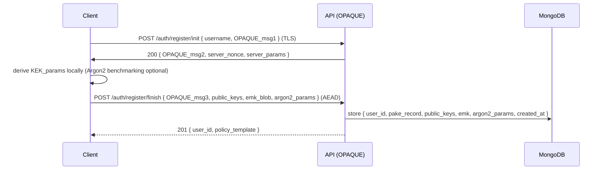

### Client responsibilities

1. Generate OPAQUE client state and OPRF response (OPAQUE_msg1->msg3).
    
2. Generate identity keys: `x25519`, `ed25519`, PQ keys (`kyber768`, `dilithium2` optional).
    
3. Create MK (32B random), derive KEK = Argon2id(password, salt, params). Encrypt `EMK = AEAD(KEK, MK, ad=jcs({user_id, crypto_version}))`.
    
4. Package `public_keys`, `emk`, `argon2_params` into AEAD envelope and send in `register/finish`.
    

### Server responsibilities

- Run OPAQUE server steps; store PAKE record (`pake_record`) and `public_keys`.
    
- Validate AEAD envelope (app-layer AEAD) and store `emk` ciphertext as uploaded (server does not decrypt).
    
- Generate `user_id` and minimal profile.
    

### DB document example (`users` minimal)

```json
{
  "_id":"u_001",
  "email":"owner@example.com",
  "pake_record":"BASE64",
  "public_keys": { "x25519":"B64", "ed25519":"B64", "kyber768":"B64" },
  "emk": { "version":"emk-v1", "nonce":"B64", "ct":"B64" },
  "argon2_params": { "m":262144, "t":2, "p":2, "salt":"B64" },
  "created_at":"2025-08-29T12:00:00Z"
}
```

**Acceptance tests**

- OPAQUE registration roundtrip produces a storable `pake_record`.
    
- `emk` saved and server cannot decrypt (CI asserts no call to client-unwrap functions).
    
- Public keys stored and verifiable.
    

**Clarification / Why**

- OPAQUE prevents offline dictionary attacks even if DB leaks. Alternative (bcrypt) allows offline cracking — unacceptable for inheritance use-case.
    

---

## 5.2 Login (OPAQUE + KEK derivation + MK retrieval)

### Sequence (detailed)

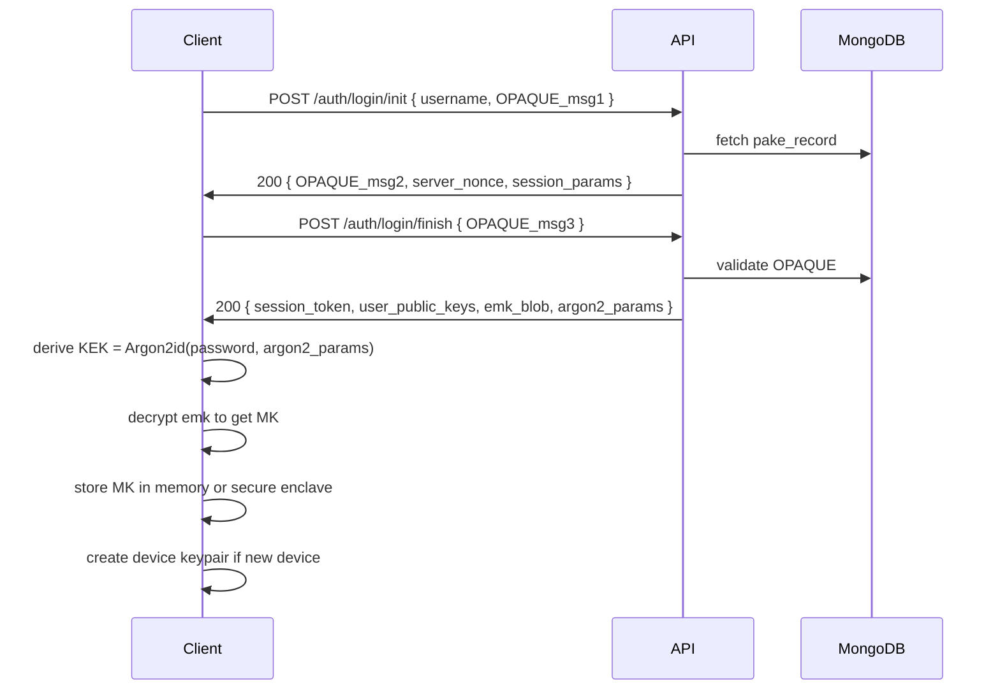

### Device binding flow (on new device)

- Client generates `ed25519` device keypair.
    
- Client signs a server-provided nonce with the device key → `device_sig`.
    
- Client sends `POST /devices/register` (AEAD) with `{device_id, public_key, device_sig, device_meta}`.
    
- Server stores device record and returns `device_id`.
    

### DB (`devices` example)

```json
{
  "device_id":"d_001",
  "user_id":"u_001",
  "device_pub":"B64(ed25519_pk)",
  "emk_device": { "nonce":"B64", "ct":"B64" }, // optional fast-unlock
  "capabilities":["webauthn"],
  "created_at":"..."
}
```

**Clarification / Why**

- Device binding allows signed heartbeats and device-based step-up for critical flows. WebAuthn provides stronger second factor than SMS/TOTP and is recommended. OPAQUE + device keys provide phish-resistant auth.
    

**Acceptance tests**

- OPAQUE login returns `emk` as ciphertext; client successfully decrypts with Argon2-derived KEK matching stored params.
    
- Device registration preserves `device_pub` and server verifies `device_sig`.
    

---

## 5.3 MFA & Step-up Authentication

### MFA Modes

- **Primary**: WebAuthn (platform/authenticator).
    
- **Fallback**: TOTP (RFC 6238), SMS (less preferred).
    
- **Optional**: Push approval (mobile).
    

### Default policy

- Require Password + WebAuthn (2FA) for login.
    
- Require Password + WebAuthn + device signature for critical actions:
    
    - Add / remove beneficiaries
        
    - Change heartbeat cadence
        
    - Cancel policy during pending/investigating
        
    - Approver registration (trusted identity binding)
        

### Step-up sequence (example: add beneficiary)

1. Client issues request to `POST /policy/{id}/beneficiaries/add` (AEAD).
    
2. Server returns an action challenge requiring `device_sig` + MFA proof.
    
3. Client performs WebAuthn assertion and signs challenge with device key; packages assertion evidence and AEAD-wrapped request.
    
4. Server verifies WebAuthn assertion (attestation) and device signature; then executes request.
    

**DB (`mfa` example)**

```json
{
  "user_id":"u_001",
  "factors": [
    { "type":"webauthn", "credential_id":"B64", "public_key":"B64", "registered_at":"..." },
    { "type":"totp", "secret_hash":"B64", "registered_at":"..." }
  ]
}
```

**Clarification / Why**

- WebAuthn is phishing-resistant and ties credentials to devices. SMS is fallback but considered weaker. Step-up with device signature ensures non-repudiation of actions.

**Acceptance tests**

- WebAuthn registration & assertion verify on server.
    
- Step-up challenge fails without correct device signature or WebAuthn assertion.
    
---

## 5.4 Password Change & EMK Rotation

### Flow

1. User initiates password change (authenticated).
    
2. Client verifies current password via OPAQUE re-auth or session + device signature.
    
3. Client derives new KEK with Argon2id(new_password, new_params) and re-encrypts MK → new `EMK`.
    
4. Client uploads `PUT /user/{user_id}/emk` (AEAD) with new EMK & new `argon2_params`.
    
5. Server stores new EMK blob; old EMK can be retained for grace (optional) for rollback.
    

**Notes**

- Items & envelopes do not need re-encryption (MK unchanged). Only KEK -> EMK changed.
    
- If Argon2 params are upgraded, prompt rewrap on next login to apply new params.
    

**Clarification / Why**

- Keeping MK stable preserves wrapped shares; only KEK changes on password change. This avoids expensive rewraps of many items.
    

**Acceptance tests**

- After change, client can decrypt emk with new password and derive MK successfully.
    
---

## 5.5 Device Enrollment & Deprovisioning

### Enroll new device

- On login, generate device key; register with server via `POST /devices/register` with `device_pub` and proof signature.
    
- Optionally create `emk_device = AEAD(DeviceKey, MK)` and store on server for convenience (decryptable only by that device).
    

### Deprovision

- User can list devices and revoke a `device_id`. Server marks device as `revoked` and increments `revocation_epoch`.
    
- Server rejects heartbeats or device signatures from revoked devices.
    

**DB**

```json
{
  "devices": [
    { "device_id":"d1", "user_id":"u_001", "revoked": false, "revoked_at": null }
  ]
}
```

**Clarification / Why**

- Device enrollment enables small-window fast unlocks. Deprovisioning is essential if a device is lost.
    

**Acceptance tests**

- Revoked device cannot send valid heartbeats or perform step-up actions.
    

---

## 5.6 Recovery Options

We provide three recovery mechanisms. Each is optional, user-configurable.

### A) Backup Key (Mnemonic) — Recommended default

- Client generates a strong mnemonic (e.g., 24-word BIP39 with 256 bits entropy) and encrypts backup export optionally with passphrase.
    
- Client shows mnemonic to user with strong UX warnings to store offline.
    
- Recovery flow: user enters mnemonic, client derives MK or derives a rewrap key to obtain EMK.
    

**Pros**: Simple, user-controlled.  
**Cons**: If lost, recovery fails.

**Implementation**

- `POST /recovery/backup/generate` (client-only): server does not store mnemonic.
    
- If user chooses to store an encrypted backup in server, client must encrypt with user-provided passphrase (server stores ciphertext) — note this weakens ZKA (user must understand risk).
    

### B) Social Recovery (Shamir) — Threshold custodians

- Client splits a recovery seed (or MK) into shares using Shamir Secret Sharing (SSS) and encrypts each share to custodian public keys (hybrid KEM envelopes).
    
- Custodians receive encrypted share invitations; they store encrypted share offline or in their account.
    
- To recover: `k-of-n` custodians provide their encrypted shares (they decrypt with their private keys) and send to recovering client; client recombines shares to reconstruct MK.
    

**Flow**

1. Owner selects custodians and threshold `k`.
    
2. Client computes SSS shares and encrypts each share to each custodian’s public key (envelope), uploads envelope to server with `share_meta`.
    
3. To recover, recoverer authenticates to custodians (out-of-band) and obtains shares; client recombines locally.
    

**Pros**: No single custodian can reconstruct; preserves ZKA if shares encrypted to custodians only.  
**Cons**: Custodians must be trustworthy and keep private keys secure; complexity in onboarding.

**DB (recovery_shares)**

```json
{
  "policy_id":"pol_u_123",
  "share_id":"rs_001",
  "custodian_user_id":"u_999",
  "enc_share": { "wrapper":"hybrid-wrap-v1", "eph_x25519_pub":"...", "kyber_ct":"...","payload":"..." },
  "created_at":"..."
}
```

### C) Legal Escrow (Opt-in, non-default)

- Enterprise or paid option: owner elects to escrow MK with a regulated custodian (HSM/KMS) under legal contract.
    
- Requires explicit consent and stringent legal reviews.
    
- **Important**: Escrow breaks ZKA guarantees and must be opt-in with visible warnings.
    

**Clarification / Why**

- Backup key is simplest; social recovery provides strong distribution of trust. Escrow is powerful but adversarial to the cryptographic goals — must be separate, auditable service.
    

**Acceptance tests**

- Recovery via mnemonic: wallet reconstructs MK and decrypts test secret.
    
- Social recovery: given k valid custodian decryptions, client recombines shares and recovers MK.
    
- Escrow flow must log consent and store custody agreement.
    

---

## 5.7 Beneficiary Invite & Registration (brief)

### Invite flow

1. Owner `POST /policies/{policy_id}/invite` with beneficiary email (owner AEAD).
    
2. Server creates `invite` record with `invite_id`, `claim_token = HMAC(server_key, invite_id|email|expires_at)`, `expires_at`.
    
3. Server emails invite link: `https://app/invite?invite=inv_abc&token=...`.
    

### Claim token consume

- Candidate registers or logs in, then calls `POST /inheritance/claim/token/consume` with `invite_id`, `claim_token`, and their `public_keys`.
    
- Server atomically marks `invite.used = true` and appends beneficiary entry to `policy.beneficiaries`.
    

**Security**

- Claim token single-use and short TTL (default 7 days).
    
- If attacker consumes token, approver attestations + documents still required to release secrets.
    

**Acceptance tests**

- Invite creation stores token HMAC and email; token consumption fails if reused.
    

---

## 5.8 Browser Extension Authentication Considerations

- **Extension onboarding**
    
    - On install, user signs into web app; extension receives session token (short-lived) and stores `emk_device` encrypted by extension private key (stored in extension storage or OS keystore if available).
        
    - On subsequent unlocks, extension may ask for OS auth (biometric).
        
- **Autofill mechanism**
    
    - Extension background script decrypts item on user action; content script receives only a pseudo-event to paste/auto-type (no plaintext in DOM).
        
    - For sites where simulated typing is blocked, extension offers manual copy with clipboard auto-clear after configurable timeout.
        
- **Permissions**
    
    - Limit host permissions to only domains the user grants.
        
    - On install, request minimal permissions and request additional on demand.
        
- **Privacy**
    
    - Do not log visited websites; store only hashed list for UX suggestions if needed, with user opt-in.
        

**Clarification / Why**

- Avoid exposing plaintext to page scripts; background-only crypto reduces exfiltration risk.
    

**Acceptance tests**

- Extension autofill works without exposing plaintext to content scripts; clipboard auto-clear enforced.
    

---

## 5.9 API Endpoints (Auth & Device examples)

> All sensitive endpoints use app-layer AEAD over TLS. Example request bodies below assume client-side AEAD wrapping according to Chunk 3.

### Register (init)

```
POST /auth/register/init
Body: { "username": "alice", "opaque_msg1": "BASE64" }
Response: { "opaque_msg2": "BASE64", "server_nonce": "ISO", "server_params": {...} }
```

### Register (finish) — AEAD-wrapped

```
PUT /auth/register/finish
Headers: X-Client-Pub, X-TS, X-Seq
Body (AEAD): jcs({
  "opaque_msg3":"BASE64",
  "public_keys": { "x25519":"B64", "ed25519":"B64", "kyber768":"B64" },
  "emk": { "version":"emk-v1", "nonce":"B64", "ct":"B64" },
  "argon2_params": { "m":262144, "t":2, "p":2, "salt":"B64" },
  "ts": "ISO"
})
```

### Login (init/finish)

```
POST /auth/login/init  { "username": "alice", "opaque_msg1":"B64" }
POST /auth/login/finish { "opaque_msg3":"B64" }  => Response includes session token + public_keys + emk + argon2_params
```

### Device register

```
POST /devices/register (AEAD)
Body (canonical JCS):
{
  "user_id":"u_123",
  "device_id":"d_001",
  "device_pub_ed25519":"B64",
  "device_meta": { "platform":"iOS", "hw_auth":"secure_enclave" },
  "device_sig": "B64" // ed25519 sign of jcs(body_without_sig) by device SK
}
```

---

## 5.10 DB Fields & Indexes (Auth & Devices)

**users**: index on `email` (unique). Fields: `pake_record`, `public_keys`, `emk`, `argon2_params`, `devices[]`.

**devices**: index on `user_id`, `device_id`. Fields: `device_pub`, `revoked`, `revoked_at`, `emk_device`.

**invariants**:

- `pake_record` must exist for any user with `emk`.
    
- `devices.emk_device` is optional; if present, must be AEAD struct.
    
- `argon2_params` present and validated on create.
    

---

## 5.11 CI Tests & Security Checks (Auth)

- **Test**: OPAQUE registration/login interop across client implementations (WASM / native).
    
- **Test**: Argon2 parameter enforcement: ensure mobile vs desktop params enforced.
    
- **Test**: Device registration: verify `device_sig` server-side.
    
- **Invariant test**: Server code has no function capable of decrypting EMK — static analysis and unit test attempt to call any client crypto; CI fails if server code imports client-crypto-unseal function.
    
- **Replay/Sequence test**: Make requests with non-monotonic `X-Seq` → server rejects.
    

---

## 5.12 Clarifications, Trade-offs & Rationale (Auth & Recovery)

1. **OPAQUE vs SRP vs Traditional Hash**
    
    - OPAQUE chosen because it prevents server from learning password-equivalent verifiers; modern standard and implementations exist. SRP is older and less widely standardized for new deployments. Storing salted hashes allows offline attacks on DB leaks — not acceptable.
        
2. **WebAuthn vs TOTP vs SMS**
    
    - WebAuthn preferred for phishing resistance. TOTP is fallback; SMS is weakest and should be optional.
        
3. **Backup Key (mnemonic)**
    
    - Balances simplicity & security. Users understand mnemonic model from wallets. Encourage secure physical storage.
        
4. **Social Recovery (Shamir)**
    
    - Distributes trust vs single backup, but requires trustworthy custodians. Best for users who opt-in.
        
5. **Escrow Option**
    
    - Breaks ZKA; must be opt-in enterprise/paid. Kept out of default flows.
        
6. **Device emk_device convenience**
    
    - Speeds unlock on devices but means an extra encrypted blob stored server-side. Still preserves ZKA because only device key can decrypt emk_device.

---

## 6. Data Model — Principles & Goals

- **Store ciphertexts only** for all secrets; never plaintext.
    
- **Minimal metadata**: only what is needed for UX and workflow (hashed titles, counts).
    
- **Append-only audit**: every state-changing operation writes an audit entry forming a hash chain.
    
- **Schema versioning**: include `schema_version` + `crypto_version` in each document to enable migration.
    
- **Validators**: enforce envelope shapes to prevent storing plaintext or malformed envelopes.
    
- **Indexes**: designed for efficient worker scans and tenant isolation (partition by `owner_id`).
    
- **Sharding**: shard by `owner_id` (owner-centric access patterns) to achieve balance and locality.
    

---

## 7. Collections & Full Schemas

All JSON examples use JCS canonicalization rules for signed payloads. Store base64url for binary blobs.

### 7.1 `users` collection

**Purpose**: store OPAQUE record, public keys, EMK, argon2 params, devices, minimal profile.

**Validator (JSON Schema)**

```js
{
  $jsonSchema: {
    bsonType: "object",
    required: ["_id","email","pake_record","public_keys","emk","argon2_params","created_at"],
    properties: {
      _id: { bsonType: "string" },
      email: { bsonType: "string" },
      legal_name: { bsonType: ["string","null"] },
      pake_record: { bsonType: "string" },
      public_keys: {
        bsonType: "object",
        required: ["x25519","ed25519","kyber768"],
        properties: {
          x25519: { bsonType: "string" },
          ed25519: { bsonType: "string" },
          kyber768: { bsonType: "string" },
          dilithium2: { bsonType: ["string","null"] }
        }
      },
      emk: {
        bsonType: "object",
        required: ["version","nonce","ct"],
        properties: {
          version: { bsonType: "string" },
          nonce: { bsonType: "string" },
          ct: { bsonType: "string" }
        }
      },
      argon2_params: {
        bsonType: "object",
        required: ["m","t","p","salt"],
        properties: {
          m: { bsonType: "int" },
          t: { bsonType: "int" },
          p: { bsonType: "int" },
          salt: { bsonType: "string" }
        }
      },
      devices: {
        bsonType: "array"
      },
      created_at: { bsonType: "date" },
      schema_version: { bsonType: "int" },
      crypto_version: { bsonType: "string" }
    }
  }
}
```

**Indexes**

- `{ email: 1 }` unique
    
- `{ _id: 1 }` default
    
- Optional: `{ "public_keys.ed25519": 1 }` for lookup by key
    

**Sample Document**

```json
{
  "_id": "u_123",
  "email": "owner@example.com",
  "legal_name": "John Doe",
  "pake_record": "BASE64",
  "public_keys": {
    "x25519": "B64",
    "ed25519": "B64",
    "kyber768": "B64"
  },
  "emk": { "version":"emk-v1", "nonce":"B64", "ct":"B64" },
  "argon2_params": { "m":262144, "t":2, "p":2, "salt":"B64" },
  "devices": [],
  "created_at": ISODate("2025-08-29T12:00:00Z"),
  "schema_version": 1,
  "crypto_version": "v1"
}
```

---

### 7.2 `items` collection

**Purpose**: store encrypted secrets and owner-wrapped enc_item_key.

**Validator**

```js
{
  $jsonSchema: {
    bsonType: "object",
    required: ["_id","owner_id","ciphertext","nonce","enc_item_key","created_at","crypto_version","schema_version"],
    properties: {
      _id: { bsonType: "string" },
      owner_id: { bsonType: "string" },
      ciphertext: { bsonType: "string" },
      nonce: { bsonType: "string" },
      enc_item_key: {
        bsonType: "object",
        required: ["wrapper","nonce","payload"],
        properties: {
          wrapper: { enum: ["mk","fk-folder"] },
          nonce: { bsonType: "string" },
          payload: { bsonType: "string" }
        }
      },
      meta: { bsonType: "object" }, // hashed title, type
      created_at: { bsonType: "date" },
      schema_version: { bsonType: "int" },
      crypto_version: { bsonType: "string" }
    }
  }
}
```

**Indexes**

- `{ owner_id: 1, _id: 1 }` (compound)
    
- `{ owner_id: 1, "meta.type": 1 }` optional
    
- TTL not used here
    

**Sample Document**

```json
{
  "_id": "it_001",
  "owner_id": "u_123",
  "ciphertext": "B64",
  "nonce": "B64",
  "enc_item_key": { "wrapper":"mk", "nonce":"B64", "payload":"B64" },
  "meta": { "title_hash":"HEX", "type":"password", "created_at":"2025-08-29T12:05:00Z" },
  "created_at": ISODate("2025-08-29T12:05:00Z"),
  "schema_version": 1,
  "crypto_version": "aead-xchacha20p1305-v1"
}
```

---

### 7.3 `shares` collection (prewrapped envelopes)

**Purpose**: store envelopes (prewraps) per (item, grantee).

**Validator**

```js
{
  $jsonSchema: {
    bsonType: "object",
    required: ["_id","item_id","granter_id","grantee_id","enc_ik_for_grantee","created_at"],
    properties: {
      _id: { bsonType: "string" },
      item_id: { bsonType: "string" },
      granter_id: { bsonType: "string" },
      grantee_id: { bsonType: "string" },
      enc_ik_for_grantee: {
        bsonType: "object",
        required: ["wrapper","eph_x25519_pub","kyber_ct","nonce","payload","meta"],
        properties: {
          wrapper: { enum: ["hybrid-wrap-v1"] },
          eph_x25519_pub: { bsonType: "string" },
          kyber_ct: { bsonType: "string" },
          nonce: { bsonType: "string" },
          payload: { bsonType: "string" },
          meta: { bsonType: "object" }
        }
      },
      grant_sig: {
        bsonType: "object"
      },
      created_at: { bsonType: "date" },
      schema_version: { bsonType: "int" },
      crypto_version: { bsonType: "string" }
    }
  }
}
```

**Indexes**

- `{ item_id: 1 }`
    
- `{ grantee_id: 1 }`
    
- `{ granter_id: 1 }`
    

**Sample Document**

```json
{
  "_id": "sh_001",
  "item_id": "it_001",
  "granter_id": "u_123",
  "grantee_id": "u_456",
  "enc_ik_for_grantee": {
    "wrapper":"hybrid-wrap-v1",
    "eph_x25519_pub":"B64",
    "kyber_ct":"B64",
    "nonce":"B64",
    "payload":"B64",
    "meta": { "owner_id":"u_123","item_id":"it_001","crypto_version":"v1" }
  },
  "grant_sig": { "alg":"ed25519-v1", "sig":"B64" },
  "created_at": ISODate("2025-08-29T12:10:00Z"),
  "schema_version": 1,
  "crypto_version": "hybrid-wrap-v1"
}
```

---

### 7.4 `policies` collection (inheritance policies)

**Purpose**: track owner-configured policies for inheritance and heartbeat state.

**Validator**

```js
{
  $jsonSchema: {
    bsonType: "object",
    required: ["_id","owner_id","status","cadence","m_of_n","beneficiaries","approvers","created_at"],
    properties: {
      _id:{ bsonType:"string" },
      owner_id:{ bsonType:"string" },
      status:{ enum:["active","pending","investigating","release_ready","conflict_pending","manual_review","released","cancelled"] },
      cadence:{ enum:["1w","15d","1m","3m"] },
      m_of_n:{ bsonType:"object", required:["m","n"], properties:{ m:{bsonType:"int"}, n:{bsonType:"int"} } },
      beneficiaries:{ bsonType:"array" },
      approvers:{ bsonType:"array" },
      heartbeats: {
        bsonType: "object",
        properties: {
          last_heartbeat_at: { bsonType: "date" },
          pending_at: { bsonType: "date" },
          grace_deadline: { bsonType: "date" }
        }
      },
      attachments:{ bsonType:"array" },
      audit_head_hash:{ bsonType:"string" },
      created_at:{ bsonType:"date" },
      schema_version:{ bsonType:"int" }
    }
  }
}
```

**Indexes**

- `{ owner_id: 1 }`
    
- `{ status: 1, "heartbeats.pending_at": 1 }` (for worker scans)
    
- `{ "beneficiaries.user_id": 1 }` (to find policies affecting a beneficiary)
    

**Sample Document**

```json
{
  "_id":"pol_u_123_20250829",
  "owner_id":"u_123",
  "status":"active",
  "cadence":"1w",
  "m_of_n": { "m":2, "n":3 },
  "beneficiaries":[
    { "type":"user","user_id":"u_456","public_keys":{ "x25519":"B64","kyber768":"B64" } },
    { "type":"email","email":"ben@example.com","invite_expires_at": ISODate("2026-01-10T00:00:00Z") }
  ],
  "approvers":[ { "role":"family","user_id":"u_789" }, { "role":"lawyer","contact_email":"law@firm.example" } ],
  "heartbeats": { "last_heartbeat_at": ISODate("2025-08-29T12:00:00Z"), "pending_at": null, "grace_deadline": null },
  "attachments": [],
  "audit_head_hash":"HEX",
  "created_at": ISODate("2025-08-29T12:00:00Z"),
  "schema_version":1
}
```

---

### 7.5 `claims` collection

**Purpose**: represent beneficiary claims for a given policy.

**Validator**

```js
{
  $jsonSchema: {
    bsonType: "object",
    required: ["_id","policy_id","beneficiary_id","status","created_at"],
    properties: {
      _id:{ bsonType:"string" },
      policy_id:{ bsonType:"string" },
      beneficiary_id:{ bsonType:"string" },
      status:{ enum:["pending_docs","docs_uploaded","attestations_in_progress","ready","withdrawn","rejected"] },
      attachments:{ bsonType:"array" },
      created_at:{ bsonType:"date" },
      schema_version:{ bsonType:"int" }
    }
  }
}
```

**Indexes**

- `{ policy_id: 1 }`
    
- `{ beneficiary_id: 1 }`
    

**Sample Document**

```json
{
  "_id":"claim_20250829_01",
  "policy_id":"pol_u_123_20250829",
  "beneficiary_id":"u_456",
  "status":"docs_uploaded",
  "attachments":[ { "s3_key":"s3://bucket/u_456/death_cert.enc","hash":"sha256hex" } ],
  "created_at": ISODate("2025-08-29T13:00:00Z"),
  "schema_version":1
}
```

---

### 7.6 `attestations` collection

**Purpose**: store approver attestations (signed canonical JSON).

**Validator**

```js
{
  $jsonSchema: {
    bsonType: "object",
    required: ["_id","policy_id","claim_id","attestor_id","attestation_hash","sig_ed25519","ts"],
    properties: {
      _id:{ bsonType:"string" },
      policy_id:{ bsonType:"string" },
      claim_id:{ bsonType:"string" },
      attestor_id:{ bsonType:"string" },
      attestation_hash:{ bsonType:"string" },
      sig_ed25519:{ bsonType:"string" },
      sig_dilithium2:{ bsonType:["string","null"] },
      meta:{ bsonType:"object" },
      created_at:{ bsonType:"date" },
      schema_version:{ bsonType:"int" }
    }
  }
}
```

**Indexes**

- `{ policy_id: 1 }`
    
- `{ claim_id: 1 }`
    
- `{ attestor_id: 1 }`
    

**Sample Document**

```json
{
  "_id":"att_20250829_01",
  "policy_id":"pol_u_123_20250829",
  "claim_id":"claim_20250829_01",
  "attestor_id":"u_789",
  "attestation_hash":"sha256hex",
  "sig_ed25519":"B64",
  "sig_dilithium2": null,
  "meta": { "notes":"Verified death certificate" },
  "created_at": ISODate("2025-08-29T14:00:00Z"),
  "schema_version":1
}
```

---

### 7.7 `audit` collection (append-only chain)

**Purpose**: tamper-evident audit entries forming a hash chain.

**Validator**

```js
{
  $jsonSchema: {
    bsonType: "object",
    required: ["_id","policy_id","actor","event_type","payload_hash","prev_hash","hash","ts"],
    properties: {
      _id:{ bsonType:"string" },
      policy_id:{ bsonType:"string" },
      actor:{ bsonType:"string" },
      event_type:{ bsonType:"string" },
      payload_hash:{ bsonType:"string" },
      prev_hash:{ bsonType:["string","null"] },
      hash:{ bsonType:"string" },
      ts:{ bsonType:"date" }
    }
  }
}
```

**Indexes**

- `{ policy_id: 1, ts: 1 }` for timeline retrieval
    
- `{ hash: 1 }`
    

**Sample Document**

```json
{
  "_id":"au_20250829_0001",
  "policy_id":"pol_u_123_20250829",
  "actor":"system",
  "event_type":"heartbeat_pending",
  "payload_hash":"sha256hex",
  "prev_hash":"prev_hex",
  "hash":"sha256(prev_hash||payload_hash)",
  "ts": ISODate("2025-08-29T12:10:00Z")
}
```

---

### 7.8 `conflicts` & `manual_reviews` collections

**`conflicts` schema (subset)**

```json
{
  "_id":"conf_001",
  "policy_id":"pol_u_123_20250829",
  "items":["it_001"],
  "claims":["claim_20250829_01","claim_20250829_02"],
  "entered_at":ISODate("2025-08-29T15:05:00Z"),
  "hold_expires_at":ISODate("2025-08-31T15:05:00Z"),
  "status":"holding"
}
```

**`manual_reviews` schema (subset)**

```json
{
  "_id":"mr_001",
  "policy_id":"pol_u_123",
  "conflict_id":"conf_001",
  "ops_ticket_id":"TKT-12345",
  "evidence":[ "att_...", "pf_..." ],
  "decision":"released_to_claimant_claim_01",
  "ops_signatures":[ { "user":"ops_1", "sig":"B64" }, { "user":"ops_2", "sig":"B64" } ],
  "created_at": ISODate(...)
}
```

---

## 8. Index & Query Patterns (for performance)

### Worker scans

- **Find pending policies**:
    
    ```js
    db.policies.find({ status: { $in: ["active","pending"] }, "heartbeats.pending_at": { $lte: now } })
    // Use index: { status: 1, "heartbeats.pending_at": 1 }
    ```
    
- **Find investigating policies**:
    
    ```js
    db.policies.find({ status: "investigating", "heartbeats.grace_deadline": { $lte: now } })
    ```
    
- **Find claims for a policy**:
    
    ```js
    db.claims.find({ policy_id: "pol_u_123" })
    // index: { policy_id: 1 }
    ```
    
- **Find attestations for a claim**:
    
    ```js
    db.attestations.find({ claim_id: "claim_20250829_01" })
    // index: { claim_id: 1 }
    ```
    

### Read patterns (user)

- Fetch user items:
    
    ```js
    db.items.find({ owner_id: "u_123" }).limit(100)
    // paginated with _id or created_at
    ```
    
- Fetch shares for a beneficiary:
    
    ```js
    db.shares.find({ grantee_id: "u_456" })
    ```
    

### Audit retrieval

- Retrieve audit chain for a policy:
    
    ```js
    db.audit.find({ policy_id: "pol_u_123" }).sort({ ts: 1 })
    ```
    

---

## 9. Sharding Strategy & Tenant Isolation

**Shard key**: `owner_id` (hashed shard key recommended for even distribution). Rationale: access patterns are owner-centric; sharding by `owner_id` ensures all owner's items and policies are localized to a shard for efficient queries and transactions.

**Shard considerations**

- Use hashed `owner_id` for write-distribution.
    
- Place global collections like `audit` sharded by `policy_id` or `policy_id` hashed.
    
- Avoid compound shard keys that include high-cardinality low-selectivity fields.
    

**Multi-tenant isolation**

- Logical tenant isolation via `owner_id`. For stronger isolation (enterprise), create separate clusters per tenant.
    

---

## 10. Backups, Retention & Archival

**Backups**

- MongoDB Atlas automated snapshots daily + continuous backups depending on tier.
    
- Export encrypted daily audit anchors to S3 (signed by KMS) — retention per legal policy.
    

**Retention policy**

- `items` & `shares`: retain until user deletion; deletion must remove `emk` if user requested complete erasure.
    
- `audit` logs: default retention 7 years (configurable).
    
- `attachments` in S3: retain per policy; old evidence packages archived to cold storage (Glacier) after 5 years.
    

**Deletion semantics**

- **Soft delete**: mark document `deleted_at` and retain for required retention period.
    
- **Hard delete**: true deletion after retention + legal hold clearance.
    
- **Crypto-centric deletion**: deleting `emk` renders items unrecoverable — treat as final deletion; log event.
    

---

## 11. Data Migration & Schema Evolution

**Versioning**

- Each collection document includes `schema_version` and `crypto_version`.
    
- Migration process:
    
    1. Deploy server supporting both old & new `schema_version`.
        
    2. On read, server handles both formats.
        
    3. On write (owner login), client rewraps items to new crypto version and updates docs with new `schema_version`.
        
    4. Background migration job for owners who opt-in to migrate at scale (requires MK access client-side).
        

**Backwards compatibility**

- Server must reject unknown `crypto_version` when creating new envelopes; provide a capability list via `GET /server/capabilities`.
    

**Migration tooling**

- Provide admin utilities to list objects with old schema/crypto versions and coordinate per-owner migration windows.
    

---

## 12. Validators & Example `collMod` Commands

**Add validator to `shares`**

```js
db.runCommand({
  collMod: "shares",
  validator: {
    $jsonSchema: {
      bsonType: "object",
      required: ["item_id","granter_id","grantee_id","enc_ik_for_grantee"],
      properties: {
        enc_ik_for_grantee: {
          bsonType: "object",
          required: ["wrapper","eph_x25519_pub","kyber_ct","nonce","payload"],
          properties: {
            wrapper: { enum: ["hybrid-wrap-v1"] }
          }
        }
      }
    }
  },
  validationLevel: "strict"
});
```

**Enforce single-use invite consumption (atomic)**

- Use a transaction: `findOneAndUpdate({ invite_id, used:false, expires_at: {$gt: now}}, { $set: { used:true, used_by: user_id } })` with `returnDocument: "after"`.
    

---

## 13. Backup & Disaster Recovery Playbook (short)

1. **Daily snapshots**: rely on Atlas snapshots; verify restores monthly in staging.
    
2. **Audit anchor exports**: sign head hash with KMS and upload to S3 `s3://audit-anchors/YYYY-MM-DD/anchor.json`.
    
3. **DR test**: quarterly restore to staging, run automated smoke tests for policies, claims, and attestation verification.
    
4. **Data corruption**: if detected, consult snapshot timeline to find last good state; consider replaying append-only audit logs to reconcile.
    
5. **Key compromise**: rotate server signing keys via KMS multi-operator; issue advisory; re-anchor audit chain and log incident.
    

---

## 14. Acceptance Tests (Data Layer)

- Creating a policy: `PUT /inheritance/policy` stores `policies` doc with `status: active` and `heartbeats.last_heartbeat_at` absent or now.
    
- Prewrap upload: `POST /shares` stores `shares` doc validated by validator; server rejects if `enc_ik_for_grantee.wrapper` != `"hybrid-wrap-v1"`.
    
- Atomic invite consume: concurrent consumption attempts cause only one to succeed (transactional `findOneAndUpdate`).
    
- Worker scan: query on `status` + `heartbeats.pending_at` returns expected policies; covered by index.
    
- Audit chain integrity: append `audit` entries and verify `hash` chain and KMS-signed daily anchor present.
    

---

## 15. Clarifications (DB choices & why)

- **MongoDB (NoSQL)** chosen for document-oriented data that naturally matches encrypted envelopes and variable item metadata—avoids heavy migrations for feature changes. Alternatives (Postgres) require normalization & complex joins; relational ACID is useful but chosen trade-off is flexibility and developer velocity.
    
- **Shard by owner_id** simplifies per-tenant queries and keeps related data co-located—helps workers fetch policy+items efficiently.
    
- **Validators** prevent accidental plaintext being stored by server-side bugs—strict validation enforced early.
    
- **Audit anchoring to S3 + KMS** ensures tamper-evidence independent of DB.
    

---

## 16. Next Steps & Integration Points

- Add these validators via migration scripts before enabling `shares` and `policies` endpoints.
    
- Create DB migration job to backfill `schema_version` and `crypto_version` for existing documents.
    
- Implement the worker query patterns as index-backed queries; stress-test with simulated data.
    

---
# API Design (Full OpenAPI-style spec, Endpoints, Envelopes, Examples) 
> You can paste this into your API design doc or use it as the base for OpenAPI 3.0 YAML conversion. Sensitive payload endpoints require the App AEAD envelope (see §A — App-layer AEAD).
---

## A — App-layer AEAD (Transport) — REQUIRED for sensitive endpoints

**Purpose:** extra layer over TLS that binds request body to a per-request ephemeral X25519 public key to mitigate TLS termination compromise.

**Client steps (must be implemented by all clients):**

1. Obtain server static X25519 public `S_X25519_PK` (from `GET /server/keys`).
    
2. Generate ephemeral X25519 `(c_eph_sk, c_eph_pk)`.
    
3. `ss = X25519(c_eph_sk, S_X25519_PK)`.
    
4. `rsk = HKDF-SHA256(ss, salt = jcs({path, ts, user_id}), info = "app-transport-v1")`.
    
5. Encrypt plaintext body: `ct = XChaCha20-Poly1305_Encrypt(rsk, nonce24, plaintext, ad = jcs({path, ts, seq}))`.
    
6. Send HTTP headers:
    
    - `Content-Type: application/octet-stream`
        
    - `X-Client-Pub: <base64url(c_eph_pk)>`
        
    - `X-TS: <RFC3339 UTC timestamp>`
        
    - `X-Seq: <uint64 sequence number per device/session>`
        
    - `Authorization: Bearer <session_token>` (if endpoint requires auth)
        
7. Request body: binary JSON
    

```json
{ "nonce":"<base64url>", "ct":"<base64url>" }
```

**Server steps:**

- Validate `X-TS` (±5 minutes allowed skew) and `X-Seq` monotonicity (per device/session).
    
- Derive `rsk` with server private X25519 key.
    
- Decrypt AEAD; reject if invalid (return `401` or `400` depending on context).
    
- For performance, prefer caching of server static key and use constant-time operations.
    

**Endpoints requiring AEAD:** all endpoints that carry secrets, attestations, envelopes, EMK blobs, and claim proofs. For GET endpoints returning sensitive bodies, server responds with AEAD-wrapped body using a symmetric key derived similarly (server generates ephemeral, client uses its private key if available; otherwise uses session key). For simplicity, GETs that return sensitive content require Bearer auth and server will AEAD-wrap response to the session's device key.

**Security note:** AEAD layer is mandatory, TLS is required; both layers together provide defense-in-depth.

---

## B — Security Schemes (conceptual; map to OpenAPI securitySchemes)

1. `BearerAuth` — standard HTTP bearer token for authenticated endpoints (OPAQUE session or server-issued JWT; tokens must be short-lived; refresh via secure refresh flow).
    
2. `AppAEAD` — per-request app-layer AEAD (not an OpenAPI standard scheme — implement as header and binary body requirement).
    
3. `AdminAPIKey` — admin operations authenticated with a scoped API key (rotate regularly; restrict by IP).
    

---

## C — Error model (JSON for non-AEAD responses)

```json
{
  "error": {
    "code": "ERR_CODE",
    "message": "Human-friendly message",
    "details": { "field":"email", "hint":"invite expired" }
  }
}
```

**Common error codes**

- `ERR_AEAD_INTEGRITY` — app-layer AEAD failed or tampered.
    
- `ERR_AUTH_REQUIRED` — missing/expired session token.
    
- `ERR_INVALID_SIGNATURE` — signature verification failed.
    
- `ERR_INVALID_CLAIM_TOKEN` — invite token invalid/used/expired.
    
- `ERR_CONFLICT` — conflicting claims or resource state.
    
- `ERR_RATE_LIMIT` — too many requests.
    
- `ERR_NOT_FOUND` — resource not found.
    
- `ERR_FORBIDDEN` — action not allowed (e.g., insufficient approvals).
    
- `ERR_SERVER_ERROR` — internal error.
    

---

## D — Rate limits & Idempotency

- Default per-user rate limit: **200 req/min** for non-sensitive endpoints; **50 req/min** for sensitive (claim, attest).
    
- Per-IP blacklist for suspicious patterns (excess claim token fails).
    
- Idempotency: endpoints that create resources support `Idempotency-Key` header. Server ensures create-once semantics for repeated same key and identical AEAD bodies (store key + response mapping for 24 hours).
    

---

## E — Core Endpoints (organized)

> For each endpoint: method, path, auth, AEAD requirement, brief description, request/response example.

### 1. Server capabilities & keys (public)

- `GET /server/capabilities`
    
    - Auth: none.
        
    - AEAD: no.
        
    - Response: JSON listing supported crypto versions, PQ availability, and server X25519 public key.
        
    - Example:
        

```json
{
  "server_id":"server_001",
  "x25519_pub":"B64URL",
  "supported_crypto_versions":["aead-xchacha20p1305-v1","hybrid-wrap-v1"],
  "supported_pq":["kyber768","dilithium2"],
  "max_aead_skew_seconds":300
}
```

---

### 2. Authentication (OPAQUE)

#### 2.1 Register Init

- `POST /auth/register/init`
    
- Auth: none
    
- AEAD: no
    
- Body: `{ "username":"email", "opaque_msg1":"BASE64" }`
    
- Response: `{ "opaque_msg2":"BASE64", "server_nonce":"ISO", "server_params":{...} }`
    

#### 2.2 Register Finish (AEAD-wrapped)

- `PUT /auth/register/finish`
    
- Auth: none (app-layer AEAD mandatory)
    
- AEAD body contains canonical JCS:
    

```json
{
  "opaque_msg3":"BASE64",
  "public_keys": { "x25519":"B64", "ed25519":"B64", "kyber768":"B64" },
  "emk": { "version":"emk-v1", "nonce":"B64", "ct":"B64" },
  "argon2_params": { "m":262144, "t":2, "p":2, "salt":"B64" },
  "legal_name":"John Doe",
  "ts":"2025-08-29T12:00:00Z"
}
```

- Response: `201 { "user_id":"u_123" }`
    

#### 2.3 Login Init / Finish

- `POST /auth/login/init` and `POST /auth/login/finish` follow OPAQUE flow.
    
- After finish, server responds with session token + `user_public_keys` + `emk` blob (ciphertext). Client derives KEK & decrypts EMK locally.
    

---

### 3. Devices

#### 3.1 Register Device

- `POST /devices/register`
    
- Auth: Bearer (session)
    
- AEAD: required
    
- Body (JCS):
    

```json
{
  "device_id":"d_abc",
  "device_pub_ed25519":"B64",
  "device_meta": { "platform":"iOS", "hw_auth":"secure_enclave" },
  "device_sig":"B64" // sign of canonical body without device_sig by device key
}
```

- Response: `201 { "device_id":"d_abc" }`
    

#### 3.2 Revoke Device

- `POST /devices/{device_id}/revoke`
    
- Auth: Bearer (owner) + Step-up (WebAuthn)
    
- AEAD: required
    
- Response: `200 { "revoked": true }`
    

---

### 4. Vault Items

#### 4.1 Create Item

- `POST /vault/items`
    
- Auth: Bearer (owner)
    
- AEAD: Required
    
- Body (JCS, AEAD): item JSON (see Chunk 3 §4.6)
    
- Response: `201 { "item_id":"it_001" }`
    

#### 4.2 Get Item Metadata

- `GET /vault/items/{item_id}`
    
- Auth: Bearer (owner)
    
- AEAD: No (returns metadata only; ciphertext not included). For full ciphertext retrieval use `GET /vault/items/{item_id}/ciphertext` which returns AEAD-wrapped ciphertext response.
    
- Response (metadata):
    

```json
{
  "item_id":"it_001",
  "owner_id":"u_123",
  "meta": { "title_hash":"HEX", "type":"password" },
  "created_at":"2025-08-29T12:05:00Z"
}
```

#### 4.3 Get Ciphertext (AEAD response)

- `GET /vault/items/{item_id}/ciphertext`
    
- Auth: Bearer (owner)
    
- AEAD: Response AEAD-wrapped using session/device key
    
- Response body (after AEAD decryption): item JSON including `ciphertext`, `nonce`, `enc_item_key_owner`.
    

#### 4.4 Delete Item

- `DELETE /vault/items/{item_id}`
    
- Auth: Bearer (owner) + Step-up
    
- AEAD: required
    
- Response: `200 { "deleted": true }`
    

---

### 5. Shares (Prewraps)

#### 5.1 Upload Share / Envelope

- `POST /shares`
    
- Auth: Bearer (owner)
    
- AEAD: required
    
- Body: Envelope JSON (see Chunk 3 §4.7) signed by owner (`grant_sig`).
    
- Server validates `grant_sig` (owner public key), stores doc, and creates audit `'share_created'`.
    
- Response: `201 { "share_id":"sh_001" }`
    

#### 5.2 List Shares for Item

- `GET /vault/items/{item_id}/shares`
    
- Auth: Bearer (owner)
    
- AEAD: no (returns metadata only)
    
- Response: list of `share_id`s and grantee_ids.
    

#### 5.3 List Shares for Beneficiary

- `GET /shares?grantee_id=u_456`
    
- Auth: Bearer (owner or grantee)
    
- AEAD: no
    

---

### 6. Policies & Heartbeats

#### 6.1 Create / Update Policy

- `PUT /inheritance/policy`
    
- Auth: Bearer (owner)
    
- AEAD: Required
    
- Canonical policy JSON (see earlier chunks).
    
- Response: `200 { "policy_id":"pol_u_123_20250829" }`
    

#### 6.2 Get Policy

- `GET /inheritance/policy/{policy_id}`
    
- Auth: Owner or authorized approvers
    
- AEAD: No (returns policy metadata; sensitive fields encrypted in policy payload stored as AEAD if needed)
    
- Response: policy JSON (ciphertext fields metadata only)
    

#### 6.3 Heartbeat

- `POST /inheritance/heartbeat`
    
- Auth: Bearer (owner) + AEAD
    
- Body JCS:
    

```json
{
  "policy_id":"pol_u_123_20250829",
  "owner_id":"u_123",
  "ts":"2025-08-29T12:00:00Z",
  "device_id":"d_1",
  "device_sig":"B64"
}
```

- Server verifies `device_sig`, updates `heartbeats.last_heartbeat_at`, returns next scheduled `pending_at` & `grace_deadline`.
    

---

### 7. Invites & Claim token

#### 7.1 Invite beneficiary

- `POST /inheritance/policy/{policy_id}/invite`
    
- Auth: Bearer (owner) + AEAD
    
- Body (JCS):
    

```json
{ "invitee_email":"ben@example.com", "invite_note":"You're listed", "expires_at":"2026-01-10T00:00:00Z" }
```

- Server creates `invite` record with `invite_id`, `claim_token = HMAC(server_signing_key, invite_id|email|expires_at)`, `expires_at`. Sends email with link.
    
- Response: `201 { "invite_id":"inv_abc" }`
    

#### 7.2 Claim token consume

- `POST /inheritance/claim/token/consume`
    
- Auth: none (but AEAD required)
    
- Body:
    

```json
{ "invite_id":"inv_abc", "claim_token":"HMAC...", "public_keys":{ "x25519":"B64","kyber768":"B64","ed25519":"B64" } }
```

- Atomic server action: check `invite.used == false && now <= expires_at` → set `used=true` and create beneficiary entry in `policy.beneficiaries`.
    
- Response: `200 { "beneficiary_user_id":"u_456" }` or `400 ERR_INVALID_CLAIM_TOKEN`
    

---

### 8. Claims & Files

#### 8.1 Initiate Claim

- `POST /inheritance/claim/initiate`
    
- Auth: Bearer (beneficiary) + AEAD
    
- Body:
    

```json
{ "policy_id":"pol_u_123_20250829", "beneficiary_id":"u_456", "claim_reason":"owner deceased", "contact_phone":"+1555..." }
```

- Response: `201 { "claim_id":"claim_20250829_01" }`
    

#### 8.2 Presign upload

- `POST /files/presign`
    
- Auth: Bearer + AEAD
    
- Body:
    

```json
{ "purpose":"death_cert", "claim_id":"claim_20250829_01", "filename":"death_cert.pdf.enc", "sha256":"...hex" }
```

- Response:
    

```json
{ "upload_url":"https://s3...","s3_key":"s3://bucket/key","expires_at":"ISO" }
```

#### 8.3 Confirm uploaded file

- `POST /files/confirm`
    
- Auth: Bearer + AEAD
    
- Body:
    

```json
{ "s3_key":"s3://bucket/key", "sha256":"...", "claim_id":"claim_20250829_01" }
```

- Server records attachment reference and sets `claim.status = docs_uploaded`.
    
- Response: `200 OK`
    

---

### 9. Attestations

#### 9.1 Submit attestation (approver)

- `POST /inheritance/attest`
    
- Auth: Bearer (approver) + AEAD
    
- Body (JCS signed):
    

```json
{
  "attestation_id":"att_20250829_01",
  "policy_id":"pol_u_123_20250829",
  "claim_id":"claim_20250829_01",
  "attestor_id":"u_789",
  "decision":"approve",
  "notes":"Verified death certificate",
  "evidence_refs":[{ "s3_key":"s3://...","hash":"sha256hex" }],
  "ts":"2025-08-29T14:00:00Z",
  "sig_ed25519":"B64"
}
```

- Server verifies `sig_ed25519` against `users.public_keys.ed25519` and stores attestation.
    
- Response: `201 { "attestation_id":"att_20250829_01" }`
    

#### 9.2 List attestations

- `GET /inheritance/attestations?claim_id=...`
    
- Auth: Owner, approver, or ops
    
- Response: array of attestation entries (signed canonical JSON + signatures)
    

---

### 10. Release & Envelopes

#### 10.1 Get envelopes for release (beneficiary)

- `GET /inheritance/envelopes?release_id=...&beneficiary_id=...`
    
- Auth: Bearer (beneficiary)
    
- AEAD: Response AEAD (server wraps envelope_batch with session/device key)
    
- Response (after AEAD unwrap):
    

```json
{
  "envelope_batch_id":"envbatch_rel_001",
  "release_id":"rel_pol_u_123_20250829_01",
  "beneficiary_id":"u_456",
  "envelopes":[ { "envelope_id":"env_it_001_ben_u456", "enc_payload": { ... } }, ... ],
  "delivery_ts":"2025-08-31T16:00:00Z"
}
```

#### 10.2 Evidence package

- `GET /inheritance/release/{release_id}/evidence`
    
- Auth: Bearer (beneficiary) or Ops (with ACL)
    
- AEAD: Response AEAD (contains signed evidence package)
    
- Response contents (JSON): `release_record`, `attestations`, `proofs references`, `audit_entries`, `anchor_signature`.
    

---

### 11. Audit & Exports

#### 11.1 Append audit entry (internal)

- `POST /audit/append`
    
- Auth: internal system identity (KMS)
    
- AEAD: required
    
- Body:
    

```json
{ "policy_id":"pol...", "actor":"system", "event_type":"heartbeat_pending", "payload_hash":"sha256hex", "prev_hash":"hex", "hash":"hex", "ts":"..." }
```

- Response: `201 { "audit_id":"au_..." }`
    

#### 11.2 Export audit chain

- `GET /audit/export?policy_id=pol_u_123`
    
- Auth: Owner or authorized auditor (requires step-up)
    
- AEAD: Response AEAD with canonical audit chain and KMS-signed anchor.
    
- Response: zipped signed JSON manifest + S3 references of attachments.
    

---

### 12. Admin / Ops Endpoints (Manual Review)

> Admin endpoints require `AdminAPIKey` + IP allowlist and multi-operator approval for destructive operations.

#### 12.1 Start manual review

- `POST /ops/manual_review`
    
- Auth: Admin API Key + AEAD
    
- Body:
    

```json
{ "policy_id":"pol_u_123", "conflict_id":"conf_001", "ops_ticket":"TKT-123", "requested_action":"review" }
```

- Response: `201 { "manual_review_id":"mr_001" }`
    

#### 12.2 Apply manual decision

- `POST /ops/manual_review/{mr_id}/decision`
    
- Auth: Admin API key + AEAD + multi-sig (requires two `ops_signatures`)
    
- Body:
    

```json
{ "decision":"release_to_claimant_claim_01", "ops_signatures":[ { "user":"ops1","sig":"B64" }, { "user":"ops2","sig":"B64" } ], "notes":"Reviewed KYC" }
```

- Server persists decision, updates `policies` & creates KMS-signed `release_record`, then proceeds with envelope delivery.
    

---

### 13. Notifications (webhooks / outbound)

- `POST /webhooks/notify` — internal: send to email/push provider; auth via internal service token.
    
- Notification payloads include `type` (owner_reminder, approver_request, beneficiary_notice) and `meta` (policy_id, claim_id).
    
- All outgoing notifications are idempotent and logged to `notifications` collection.
    

---

## F — Examples (end-to-end)

### Create policy (client AEAD) — simplified example

Client constructs canonical JCS policy JSON, AEAD-wraps, sets headers: `X-Client-Pub`, `X-TS`, `X-Seq`, sends `PUT /inheritance/policy`. Server decrypts, stores policy, and returns `policy_id`.

### Attestation verify example

Approver constructs canonical attestation JSON, computes `sha256`, signs with Ed25519, AEAD-wraps the message, sends `POST /inheritance/attest`. Server checks attestor public key, verifies signature, stores attestation, appends audit.

---

## G — Security & Operational Rules (API-level)

1. **All signed payloads** must be canonicalized with JCS before hashing & signing. Server rejects signatures if payload not canonical. Clients must supply canonical JSON string in AEAD body.
    
2. **All endpoints that accept sensitive data** must use App AEAD envelope. Server will reject non-AEAD requests with `ERR_AEAD_INTEGRITY`.
    
3. **Claims & invites**: `claim_token` is single-use; server enforces atomic consumption via transaction or `findOneAndUpdate`.
    
4. **Audit logging**: every state-changing endpoint must create an `audit` entry prior to committing business change (transaction).
    
5. **Rate limiting & abusive behavior**: frequent claim_token failures or repeated invalid signatures should raise `suspicious_activity` alerts and throttle IP.
    
6. **Sensitive response handling**: server returns ciphertext-only envelopes; clients must be prepared to unwrap.
    
7. **Admin ops**: sensitive admin endpoints require multi-operator approval for finalizing releases (two admin API keys signatures).
    

---

## H — Idempotency & Concurrency Patterns

- Create endpoints accept `Idempotency-Key` header. Example: invite creation uses it to avoid duplicate invites on retries.
    
- For critical multi-step flows (invite consume, claim create, attestation submit), server performs transactional updates and writes `audit` atomically.
    
- Workers are idempotent — each job checks for existing state before performing action.
    

---

## I — API Versioning & Compatibility

- API root: `https://api.inheritance.example.com/v1/`
    
- Backwards-incompatible changes must bump major version; for minor changes provide `Accept-Version` header and server-side default to highest supported.
    
- Each document stored in DB has `schema_version` & `crypto_version`. API exposes `server/capabilities` which clients check on startup.
    

---

## J — OpenAPI (starter fragment)

Below is a compact OpenAPI-like fragment (YAML-like pseudocode) for machine translation. Use this as the authoritative contract for codegen; expand as needed.

```yaml
openapi: "3.0.3"
info:
  title: Inheritance Vault API
  version: "v1"
servers:
  - url: https://api.inheritance.example.com/v1
components:
  securitySchemes:
    BearerAuth:
      type: http
      scheme: bearer
  schemas:
    EncryptedEnvelope:
      type: object
      properties:
        nonce: { type: string }
        ct: { type: string }
paths:
  /server/capabilities:
    get:
      summary: Server capabilities & public keys
      responses:
        '200':
          content:
            application/json:
              schema:
                type: object
  /auth/register/init:
    post:
      summary: OPAQUE register init
  /auth/register/finish:
    put:
      summary: OPAQUE register finish (AEAD)
      requestBody:
        content:
          application/octet-stream:
            schema:
              $ref: '#/components/schemas/EncryptedEnvelope'
  /inheritance/policy:
    put:
      summary: Create or update inheritance policy
      security:
        - BearerAuth: []
      requestBody:
        content:
          application/octet-stream:
            schema:
              $ref: '#/components/schemas/EncryptedEnvelope'
  /inheritance/attest:
    post:
      summary: Submit attestation (AEAD)
      security:
        - BearerAuth: []
      requestBody:
        content:
          application/octet-stream:
            schema:
              $ref: '#/components/schemas/EncryptedEnvelope'
  /inheritance/envelopes:
    get:
      summary: Fetch envelopes for a release (AEAD response)
      security:
        - BearerAuth: []
```

---

## K — Testing & Interop Recommendations

1. **Create test vectors** for AEAD transport: client ephemeral key, server static key, message, expected ct.
    
2. **Cross-client tests**: Rust(WASM)/TS/Kotlin produce compatible envelopes/unwrapping for hybrid KEM.
    
3. **Automated signature tests**: generate attestation JSON in JCS on all clients, sign, and verify on server.
    
4. **Mock KMS** in CI for signing; test KMS integration with dual-operator rotation.
    
5. **Simulate race conditions** for invite consumption (concurrent requests) to verify atomicity.
    

---

## L — Webhooks & Notifications (ops integration)

- `POST /webhooks/notify` (internal)
    
    - Auth: internal token
        
    - Body: `{ "type":"owner_reminder","policy_id":"pol_...","emails":["owner@example.com"], "payload": {...} }`
        
    - Outbound system calls configured provider (SES/Sendgrid) and logs event.
        
- `POST /webhooks/ops` (external)
    
    - For sending ops tickets to Jira/ServiceNow; only admin allowed.
        

---

## M — Final Notes (API Governance)

- Publish OpenAPI YAML in repo and generate SDKs for Web (TS), iOS (Swift), Android (Kotlin), and extension (TS).
    
- Enforce linting & contract tests in CI (contract tests ensure server responses match generated client expectations).
    
- Provide a test environment `https://api.test.inheritance.example.com` with pre-seeded test vectors and KMS stub for integration testing.
    

---

## 9. Client Architecture (overview)

All clients share the same responsibilities and constraints:

- **Perform all sensitive crypto locally** (MK generation, Argon2, IK management, hybrid KEM wraps/unpacks, Ed25519 signatures).
    
- **Use a shared crypto core** implemented in Rust (libsodium + liboqs bindings) compiled to WASM for web and to native libs for mobile.
    
- **Provide thin platform bindings**:
    
    - Web: TypeScript wrapper around WASM.
        
    - Extension: same TS wrapper re-used from web but with secure storage & background process model.
        
    - Mobile: JNI/Swift wrappers calling native Rust library.
        
- **Follow canonicalization (JCS) everywhere** before hashing and signing.
    
- **Use App-layer AEAD for all sensitive HTTP requests** (see Chunk 3).
    

Component diagram (client-side):

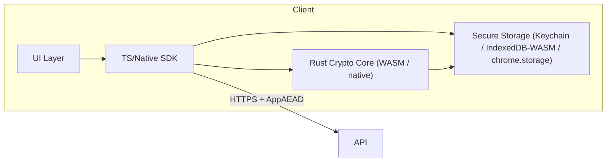

---

## 10. Rust Crypto Core (WASM + native)

**Why Rust**

- Memory safety, performance, easy to compile to WASM and native libraries.
    
- Good ecosystem: `libsodium-sys`, `liboqs` bindings, `wasm-bindgen` for TS interop.
    

**Components inside core**

- XChaCha20-Poly1305 AEAD (libsodium)
    
- X25519 ECDH routines
    
- Kyber-768 encapsulate/decapsulate via liboqs
    
- Ed25519 sign/verify
    
- Dilithium-2 sign/verify (optional PQ signature)
    
- HKDF-SHA256 utilities
    
- Argon2id binding for KDF (or use a platform Argon2 implementation where available)
    
- JCS canonicalization helper (deterministic JSON canonicalizer)
    
- Secure memory utilities to zeroize buffers
    
- Test vector runner & FFI for unit tests
    

**API exported to JS/TS**

- `generate_master_key() -> Uint8Array(32)`
    
- `derive_kek(password, salt, params) -> Uint8Array(32)`
    
- `encrypt_aead_xchacha20(key, nonce24, plaintext, ad) -> ciphertext`
    
- `decrypt_aead_xchacha20(key, nonce24, ciphertext, ad) -> plaintext`
    
- `x25519_generate_keypair() -> {pk, sk}`
    
- `x25519_scalar_mult(sk, pk) -> shared`
    
- `kyber_encapsulate(pk) -> {ct, ss}`
    
- `kyber_decapsulate(ct, sk) -> ss`
    
- `hkdf_sha256(ikm, salt, info, length)`
    
- `ed25519_sign(sk, message)`, `ed25519_verify(pk, message, sig)`
    
- `jcs_canonicalize(obj) -> bytes`
    
- `zeroize(buffer)`
    

**Build targets**

- WASM (wasm32-unknown-unknown) + `wasm-bindgen` for web and extension
    
- iOS (aarch64) staticlib
    
- Android (armv7/aarch64) via JNI
    

**Distribution**

- Publish prebuilt WASM artifacts to CI artifact store.
    
- Version crates and bind generated TypeScript types for SDK.
    

---

## 11. TypeScript SDK (surface & detailed functions)

The TS SDK wraps the WASM core and provides high-level operations clients need.

### 11.1 SDK public API (principal functions)

```ts
// Auth & account
registerStart(email: string): Promise<OpaqueInitResponse>
registerFinish(payloadEnvelope: EncryptedEnvelope): Promise<{ userId: string }>

loginStart(email: string): Promise<OpaqueLoginResp>
loginFinish(payloadEnvelope: EncryptedEnvelope): Promise<{ sessionToken: string, emk: EncryptedEnvelope, publicKeys }>

// Key management
generateMasterKey(): Promise<Uint8Array>
deriveKEK(password: string, salt: Uint8Array, params: Argon2Params): Promise<Uint8Array>
unwrapEMK(emkEnvelope: EncryptedEnvelope, kek: Uint8Array): Promise<Uint8Array> // returns MK

// Items & envelopes
createItem(plaintext: string, meta: ItemMeta): Promise<ItemDoc>
encryptItemLocally(plaintext: Uint8Array, ik: Uint8Array, meta: object): {nonce, ciphertext}
prewrapForBeneficiary(itemId: string, ik: Uint8Array, beneficiaryPubKeys): Promise<Envelope>
unwrapEnvelope(envelope: Envelope, beneficiaryKeys): Promise<Uint8Array> // returns IK

// Attestation/signing
signAttestation(attestationObj: object, edSignerKey: Uint8Array): Promise<SigObject>

// AEAD transport helpers
createAppAeadRequest(path: string, body: object, deviceSeq: number): Promise<{headers, body}>
decryptAppAeadResponse(headers: Headers, body: EncryptedEnvelope): Promise<object>
```

### 11.2 Detailed function behavior & examples

**createAppAeadRequest**

- Inputs: `path` (string), `body` (JSON object), `deviceSeq` (uint64)
    
- Steps:
    
    1. `c_eph = x25519_generate_keypair()`
        
    2. `ss = x25519_scalar_mult(c_eph.sk, server_x25519_pk)` (server public key cached in SDK)
        
    3. `rsk = hkdf_sha256(ss, salt = jcs({path, ts, user_id}), info="app-transport-v1")`
        
    4. `nonce = randomBytes(24)`
        
    5. `plaintext = JSON.stringify(body)` (must already be JCS-canonicalized if signing necessary)
        
    6. `ct = xchacha20p1305.encrypt(rsk, nonce, plaintext, ad = jcs({path, ts, seq}))`
        
    7. Return headers: `X-Client-Pub`, `X-TS`, `X-Seq`, and body `{nonce, ct}`
        

**unwrapEnvelope**

- Returns `IK_item` as `Uint8Array`.
    
- Verifies envelope `meta.owner_id` matches expected and checks any included `grant_sig` against owner's ed25519 public key for intent. (If server stored `grant_sig`, client can verify; client should not require it to decrypt.)
    

### 11.3 Example: prewrap API call (end-to-end)

```ts
const ik = await sdk.unwrapEmkToGetIK(item.enc_item_key, mk); // client-side only
const env = await sdk.prewrapForBeneficiary(item.id, ik, { x25519: ben.x25519, kyber768: ben.kyber });
const aeadReq = await sdk.createAppAeadRequest("/shares", env, deviceSeq++);
await fetch("/shares", { method: "POST", headers: aeadReq.headers, body: JSON.stringify(aeadReq.body) });
```

### 11.4 Error handling

- SDK returns structured errors: `{ code: "ERR_*", message, meta }`.
    
- On AEAD failures, SDK should mark session invalid and prompt re-auth.
    

---

## 12. Browser Extension (MV3) — Secure Design

**Key goals**

- Keep plaintext out of DOM & content scripts.
    
- Run heavy crypto in extension background service worker (WASM).
    
- Minimize permissions and host access; request host permissions on demand per domain.
    
- Securely store encrypted EMK and device keys; prefer platform keystore (Chrome OS / OS-level) where possible.
    

### 12.1 Extension processes

- **Background** (service worker): hosts WASM core, handles AEAD requests, decrypts on user interaction, manages storage.
    
- **Popup UI**: minimal UI, requests secrets from background (postMessage).
    
- **Content script**: only used to perform simulated typing; never receives plaintext.
    
- **Options page**: settings for heartbeat, beneficiaries, backup keys.
    

### 12.2 Storage

- Use `chrome.storage.local` for encrypted blobs (`emk_device`, `encrypted_index`). All secrets in storage are ciphertext only.
    
- If available, use `chrome.identity` or OS keystore to store the local device key decryptor (native messaging bridge for desktop app can allow hardware-backed key storage).
    

### 12.3 Autofill flow (secure)

1. User clicks extension icon or triggers shortcut.
    
2. Popup displays search; user selects credential.
    
3. Extension background decrypts secret in memory (WASM).
    
4. Extension either:
    
    - Simulates typing into focused field via content script (sending only a command; content script performs synthetic keyboard events), OR
        
    - Copies to clipboard and auto-clears clipboard after 20 seconds.
        
5. Clear plaintext from background memory immediately after use.
    

**Security controls**

- Time-limited plaintext in memory; zeroize buffer after use.
    
- Clipboard auto-clear and confirmation prompt for sites with domain mismatch.
    
- Permission prompts: ask for domain permission only when user interacts with that site.
    

### 12.4 Extension permissions policy

- Minimal `"host_permissions"` at install; request extra hosts dynamically via `chrome.permissions.request`.
    
- `"activeTab"` permission for one-time actions.
    
- No `"all_urls"` default.
    

### 12.5 Update & supply chain security

- Sign extension packages.
    
- CI must build and produce signed artifacts.
    
- Releases require dual approval from two maintainers.
    

### 12.6 Extension Edge Cases

- If site blocks typed events (anti-bot), fallback to manual copy with clipboard auto-clear.
    
- If background worker terminated (MV3), rehydrate WASM and cached bindings from storage when needed.
    

---

## 13. Mobile App Specifics (iOS & Android)

### 13.1 Secure Storage

- **iOS**: Store device keys and encrypted EMK in Keychain with `kSecAttrAccessibleWhenUnlockedThisDeviceOnly`. Use Secure Enclave for private key generation if available.
    
- **Android**: Use Android Keystore (hardware-backed) and `setUserAuthenticationRequired` where available.
    

### 13.2 Biometrics

- Use platform biometric APIs to gate access to EMK unwrapping & shortcut unlocks (local unlock, not server auth).
    

### 13.3 Background Heartbeat

- Use background-safe scheduling (iOS background fetch limitations: provide guidance to user to open app periodically) and server-side grace windows large enough to accommodate mobile constraints.
    

### 13.4 App Bundling of WASM/native libs

- Include compiled native Rust library for mobile.
    
- Integrate JNI (Android) / Swift interop (iOS).
    
- Ensure app binary size is optimized: lazily load PQ libs when performing prewraps.
    

### 13.5 Offline behaviors

- Allow read-only access to already-decrypted secrets cached in memory for short durations if user has unlocked recently; avoid persistent plaintext cache on disk.
    

---

## 14. Tests, CI & Interop

### 14.1 Unit tests (client)

- AEAD transport round-trip tests (use test server keypair in CI).
    
- Envelope wrap/unwrap interop tests using Rust native & WASM bindings + TS.
    
- JCS canonicalization deterministic tests across implementations.
    
- Argon2 parameter tests: ensure mobile/desktop param sets produce consistent KEK lengths.
    

### 14.2 Integration tests

- End-to-end: register -> create item -> prewrap -> simulate heartbeat miss -> claim -> attestation -> release -> beneficiary unwrap.
    
- KMS stub in CI to test signing & release_record workflows.
    

### 14.3 Fuzz & property tests

- Fuzz envelope parsing (invalid base64, corrupted kyber_ct).
    
- Property tests for HKDF key derivation (consistent across implementations).
    

### 14.4 Security tests

- Verify zeroization of secrets (memory scanning tools in CI).
    
- Static analysis for accidental `console.log` of secrets.
    
- UI tests ensure extension content script never receives plaintext.
    

---

## 15. Build & Release Security

- Sign all builds.
    
- Reproducible builds for WASM artifacts.
    
- CI gates: unit tests, integration tests, security lint, SCA (dependency scanning).
    
- Key rotation for developer keys & CI tokens.
    

---

## 16. Detailed Example: Extension Autofill Implementation (pseudo-TS)

```ts
// background.ts
import { wasm } from "./crypto_wasm"; // wasm init
chrome.runtime.onMessage.addListener(async (msg, sender, sendResponse) => {
  if (msg.type === "REQUEST_SECRET") {
    const { itemId } = msg;
    const session = await loadSession();
    const env = await fetchEnvelope(itemId, session);
    const ik = await wasm.unwrapEnvelope(env, session.benKeys);
    const item = await fetchItemCiphertext(itemId);
    const plaintext = await wasm.decryptItem(item.ciphertext, ik, item.ad);
    // simulate typing by sending only plain text to content script to type (not to page)
    chrome.tabs.sendMessage(sender.tab.id, { type: "TYPE_SECRET", secret: plaintext });
    // zeroize
    wasm.zeroize(plaintext);
    sendResponse({ ok: true });
  }
});
```

```ts
// content_script.ts
chrome.runtime.onMessage.addListener((msg) => {
  if (msg.type === "TYPE_SECRET") {
    const secret = msg.secret;
    // simulate keyboard events (no insertion into DOM)
    simulateTyping(secret);
    // do not expose secret further
  }
});
```

**Important**: content script does not persist secret; background script must zeroize buffers after send.

---

## 17. Privacy & UX Considerations

- Provide clear onboarding that explains zero-knowledge model (server cannot decrypt).
    
- Warn users about consequences of losing backup key / not prewrapping.
    
- Offer default recommended settings: WebAuthn, weekly heartbeat, backup mnemonic.
    
- Provide step-by-step wizard for adding beneficiaries and prewrapping.
    

---

## 18. Acceptance Criteria (Clients)

- All clients can decrypt and unwrap envelopes produced by any other client implementation (WASM/Native interop).
    
- Browser extension never writes plaintext to storage or passes it to page context.
    
- On phone, secure enclave is used to store device keys where available.
    
- AEAD transport implemented and validated by interop tests (match server KATs).
    
- CI ensures no commits include secrets or logs of secrets.
    

---

## 19. Developer Checklist (for client teams)

-  Integrate Rust crypto core with wasm-bindgen and generate TS types.
    
-  Implement JCS canonicalization in the SDK.
    
-  Implement AEAD transport helper used by all sensitive endpoints.
    
-  Implement Argon2 benchmarking and store `argon2_params`.
    
-  Implement prewrap/unwrap functions with hybrid KEM and provide test vectors.
    
-  Add unit + integration tests to CI that exercise full inheritance flow.
    
-  Implement extension with background-only decryption and content script typing fallback.
    
-  Security review and supply-chain checks before release.
    
---
## 20. Flow overview (short)

1. Owner configures `policy` and (optionally) prewraps items to beneficiaries → upload `shares`.
    
2. Owner heartbeats regularly. Missed heartbeats trigger state transitions `active → pending → investigating`.
    
3. Worker notifies beneficiaries & approvers to claim. Beneficiary initiates `claim` and uploads encrypted proof (death certificate).
    
4. Approvers submit signed attestations (Ed25519). Server verifies signatures and records them.
    
5. Worker evaluates m-of-n. If satisfied and proofs present → create `release_record`, KMS signs it, set `release_ready` and start 48-hour conflict hold.
    
6. If no conflict: deliver envelope_batch AEAD to beneficiary. If conflict: wait 48-hours; if unresolved escalate to manual review, ops decide with 2 ops signatures; then sign final `release_record` and deliver.
    
7. Create final `audit` entries & evidence package for legal export.
    

---

## 21. Timers, Cadence & Grace Rules (exact)

**Cadence options (owner chooses):**

- `1w` (weekly)
    
- `15d` (15 days)
    
- `1m` (30 days)
    
- `3m` (90 days)
    

**Grace rules (exact mapping):**

- If cadence = `1w`:
    
    - `pending_at = last_heartbeat_at + 7 days`
        
    - `grace_deadline = pending_at + 28 days` (4× cadence)
        
    - Notifications: remind at pending_at - 3d, pending_at - 1d, pending_at (last week per-day reminders), last day -> 2 reminders.
        
- If cadence = `15d`:
    
    - `pending_at = last_heartbeat_at + 15 days`
        
    - `grace_deadline = pending_at + 45 days` (3× cadence)
        
- If cadence = `1m`:
    
    - `pending_at = last_heartbeat_at + 30 days`
        
    - `grace_deadline = pending_at + 90 days` (3× cadence)
        
- If cadence = `3m`:
    
    - `pending_at = last_heartbeat_at + 90 days`
        
    - `grace_deadline = pending_at + 90 days` (1× cadence)
        

**Worker schedule**

- Worker runs hourly and executes transitions:
    
    - For policies where `now >= pending_at` and `status == active` → set `status = pending`, schedule reminders (owner).
        
    - For policies where `status == pending` and `now >= grace_deadline` → set `status = investigating`, notify beneficiaries & approvers.
        
    - For `status == investigating`, worker accepts `claims` and `attestations`.
        

**Conflict hold**

- After release_record creation, set `conflict_hold_until = now + policy.release_conditions.conflict_hold_hours` (default 48 hours). Do not deliver envelopes until conflict_hold expires (unless resolved earlier by explicit consensus).
    

---

## 22. Notification templates

**Owner reminder sequence (for example cadence=1w)**

- Initial notice (3 days before pending_at):
    

Subject: `Action required: keep your Inheritance Vault active`

Body:

```
Hi {{legal_name}},

We noticed your heartbeat cadence is weekly. If you don't sign in by {{pending_at_iso}}, your inheritance policy will enter a pending state and beneficiaries will be notified.

If you are away, you can postpone the check-in or change your cadence in Settings.

- View policy: https://app/inheritance/policy/{{policy_id}}

Regards,
Inheritance Vault Team
```

- Last week reminders (daily) and last day (2x), copy similar with urgency.
    

**Beneficiary invite / notification (after investigating)**

Subject: `Claim available: {{owner_name}}'s Inheritance Vault`

Body:

```
Hi {{beneficiary_name}},

{{owner_name}} has listed you as a beneficiary for their Inheritance Vault. Because {{owner_name}} missed multiple heartbeats, the policy is in investigation status.

What you can do now:
1. Initiate a claim: https://app/inheritance/claim/initiate?policy={{policy_id}}
2. Upload required documents (death certificate, ID) via the secure presigned upload.
3. Provide any supporting evidence.

You will need to pass approver attestations and a final review. See the checklist here: https://app/inheritance/help/claim-checklist

Sincerely,
Inheritance Vault Team
```

**Approver attestation request**

Subject: `Action requested: please attest to {{owner_name}}'s claim`

Body:

```
Hi {{approver_name}},

You have been listed as an approver for {{owner_name}}'s inheritance policy (policy id: {{policy_id}}). A claim has been initiated by {{beneficiary_name}}.

Please review the submitted documents and, if satisfied, submit an attestation via this secure link:
https://app/inheritance/attest?claim={{claim_id}}

You must sign the attestation (Ed25519) from your registered device.

Thanks,
Inheritance Vault Team
```

**Conflict notification to claimants (48h hold)**

Subject: `Conflict detected on claim for {{owner_name}} — manual review may be required`

Body:

```
Hi {{claimant_name}},

A conflict was detected: multiple claimants have requested access to {{owner_name}}'s assets (policy: {{policy_id}}). We have placed a 48-hour hold to allow additional evidence or withdrawals.

Please upload any additional documents or withdraw your claim if it is a duplicate. If unresolved after 48 hours, the case will be escalated to manual review by our operations team.

Sincerely,
Inheritance Vault Team
```

---

## 23. Exact API payloads (canonicalized via JCS) — all examples are JCS canonical JSON

> All client payloads for sensitive actions must be AEAD-wrapped per App-layer AEAD.

### 23.1 Create policy (owner) — `PUT /inheritance/policy`

Canonical JSON body (before AEAD-enveloping):

```json
{
  "policy_id":"pol_u_123_20250829",
  "owner_id":"u_123",
  "cadence":"1w",
  "m_of_n": { "m": 2, "n": 3 },
  "beneficiaries":[
    { "type":"user", "user_id":"u_456" },
    { "type":"email", "email":"ben@example.com", "invite_expires_at":"2026-01-10T00:00:00Z" }
  ],
  "approvers":[
    { "role":"family", "user_id":"u_789" },
    { "role":"lawyer", "contact_email":"law@firm.example" },
    { "role":"friend", "contact_email":"friend@example.com" }
  ],
  "release_conditions": {
    "require_death_certificate": true,
    "conflict_hold_hours": 48
  },
  "created_at":"2025-08-29T12:00:00Z",
  "crypto_version":"v1",
  "schema_version":1
}
```

**Server result**: store policy doc and `audit` entry `policy_created` with `payload_hash = sha256(JCS(policy))`.

---

### 23.2 Owner heartbeat — `POST /inheritance/heartbeat`

Canonical JSON (client-signed by device Ed25519):

```json
{
  "policy_id":"pol_u_123_20250829",
  "owner_id":"u_123",
  "ts":"2025-10-01T10:00:00Z",
  "device_id":"d_1",
  "device_sig":"B64_ED25519_SIGNATURE"
}
```

- `device_sig` is Ed25519 of `sha256(JCS(body_without_device_sig))` signed with device private key.
    
- Server verifies `device_sig`, updates `policies.heartbeats.last_heartbeat_at = ts`, recalculates `pending_at` and `grace_deadline` using cadence mapping, writes `audit` `'heartbeat_received'`.
    

---

### 23.3 Invite beneficiary email — `POST /inheritance/policy/{policy_id}/invite`

Canonical JSON (owner AEAD):

```json
{
  "invitee_email":"ben@example.com",
  "invite_note":"Please create an account to become beneficiary",
  "expires_at":"2026-01-10T00:00:00Z"
}
```

**Server actions**:

- create `invite_id`, compute `claim_token = HMAC(server_secret, invite_id|email|expires_at)`.
    
- store invite doc: `{ invite_id, policy_id, email, claim_token_hmac, expires_at, used:false }`.
    
- send email containing `invite_id` and claim link with `claim_token`.
    
- `audit` `'invite_created'`.
    

---

### 23.4 Claim initiation — `POST /inheritance/claim/initiate`

Canonical JSON (beneficiary AEAD & signed by beneficiary device):

```json
{
  "claim_id":"claim_20251001_01",
  "policy_id":"pol_u_123_20250829",
  "beneficiary_id":"u_456",
  "claim_reason":"Owner passed away",
  "contact_phone":"+15555555555",
  "ts":"2025-10-01T12:00:00Z",
  "sig_ed25519":"B64" // signature of sha256(JCS(body_without_sig))
}
```

**Server**:

- Verify signature against beneficiary `ed25519` public key.
    
- Create `claims` doc with `status = "pending_docs"`.
    
- `audit` `'claim_initiated'`.
    

---

### 23.5 File presign and upload (death certificate) — `POST /files/presign` then S3 PUT

Presign request (AEAD):

```json
{
  "claim_id":"claim_20251001_01",
  "policy_id":"pol_u_123_20250829",
  "purpose":"death_certificate",
  "filename":"death_cert.pdf.enc",
  "sha256":"HEX_SHA256_OF_CLIENT_SIDE_ENCRYPTED_FILE",
  "ts":"2025-10-01T12:05:00Z"
}
```

Server returns:

```json
{
  "upload_url":"https://s3.amazonaws.com/...?...",
  "s3_key":"s3://bucket/policy/pol_u_123/claim_claim_20251001_01/death_cert.enc",
  "expires_at":"2025-10-01T12:10:00Z"
}
```

Client must:

1. Encrypt the **file bytes** locally with client AEAD (file-key) and upload ciphertext to `upload_url` (S3).
    
2. POST `/files/confirm` AEAD with `{ s3_key, sha256 }` to record the attachment.
    

Server will:

- Verify `sha256` matches the uploaded object (server-side head only).
    
- Store attachment reference in `claims.attachments`.
    
- Update `claim.status = "docs_uploaded"`.
    
- `audit` `'proof_uploaded'`.
    

**Important**: never upload plaintext; always upload client-encrypted ciphertext.

---

### 23.6 Approver attestation — `POST /inheritance/attest`

Canonical attestation (JCS) signed by approver Ed25519 (attestor signs `sha256(JCS(attestation))`):

```json
{
  "attestation_id":"att_20251001_01",
  "policy_id":"pol_u_123_20250829",
  "claim_id":"claim_20251001_01",
  "attestor_id":"u_789",
  "decision":"approve",
  "notes":"Death certificate validated with civil registry under case #XYZ",
  "evidence_refs":[ { "s3_key":"s3://bucket/.../death_cert.enc", "hash":"sha256hex" } ],
  "ts":"2025-10-01T14:00:00Z",
  "sig_ed25519":"B64"
}
```

Server actions:

- Verify `sig_ed25519` using `users.public_keys.ed25519`.
    
- If valid, insert attestation into `attestations`.
    
- Recompute `approve_count = count(attestations where decision == 'approve')` for that claim.
    
- `audit` `'attestation_added'`.
    

**Acceptance rule for m-of-n**

- Worker checks: if `approve_count >= policy.m_of_n.m` then the `attestations` condition is satisfied.
    

---

### 23.7 Release readiness & release_record creation

**Worker preconditions to create `release_record`**

- `policy.status == investigating`
    
- `claim.status` in `["docs_uploaded","attestations_in_progress","ready"]`
    
- `release_conditions.require_death_certificate == true` → attachments present
    
- `approve_count >= m_of_n.m`
    
- No manual hold flags present
    

**Release_record canonical JSON (JCS)** — Worker constructs this and then sends to KMS for signing:

```json
{
  "release_id":"rel_pol_u_123_20251001_01",
  "policy_id":"pol_u_123_20250829",
  "claim_id":"claim_20251001_01",
  "beneficiaries":[ { "beneficiary_id":"u_456", "items":[ "it_001", "it_002" ] } ],
  "attestations":[ "att_20251001_01", "att_20251001_02" ],
  "proofs":[ { "s3_key":"s3://bucket/.../death_cert.enc", "hash":"sha256hex" } ],
  "issued_at":"2025-10-01T15:00:00Z",
  "conflict_hold_until":"2025-10-03T15:00:00Z",
  "schema_version":1,
  "crypto_version":"v1"
}
```

**KMS signing**

- Worker computes `hash = sha256(JCS(release_record))`.
    
- Worker requests signature via `KMS.sign(hash)` (KMS holds server signing private key).
    
- KMS returns `server_sig` (signature blob).
    
- Worker stores `release_record` with `server_sig` and sets `policy.status = release_ready`.
    
- Worker also writes `audit` `'release_record_signed'` with `payload_hash = sha256(JCS(release_record))` and `prev_hash` chaining to previous audit.
    

**Start conflict hold**

- Set `conflict_hold_until = now + policy.release_conditions.conflict_hold_hours` (default 48h).
    
- Notify claimants of pending release and conflict hold with link to evidence.
    

---

### 23.8 Conflict detection & 48-hour hold logic (exact)

**Conflict if**:

- More than one active `claim` references one or more overlapping `items` in the same policy, OR
    
- Multiple claimants request same subset of high-value items.
    

**On conflict**

- Set `policy.status = conflict_pending` and create `conflict` doc:
    

```json
{
  "conflict_id":"conf_20251001_01",
  "policy_id":"pol_u_123_20250829",
  "items":["it_001"],
  "claims":["claim_20251001_01","claim_20251001_02"],
  "entered_at":"2025-10-01T15:05:00Z",
  "hold_expires_at":"2025-10-03T15:05:00Z",
  "status":"holding"
}
```

- Notify all claimants and set explicit instructions:
    
    - upload additional evidence
        
    - withdraw if duplicate
        
    - contact emergency contacts
        

**During hold**

- Worker continues to accept additional `attestations` or evidence; if one claimant withdraws → re-evaluate `m-of-n` for remaining claimants. If exactly one claimant satisfies conditions before hold expiry → proceed to release for that claimant.
    

**If unresolved at hold expiry**

- Create `manual_review` ticket and notify Ops with precise checklist.
    

---

### 23.9 Manual Ops Review — exact checklist & playbook

**Trigger**: `policy.status == conflict_pending` and `now >= hold_expires_at` OR `policy.status == investigating` but special flags (e.g., flagged by approver) require manual review.

**Manual review playbook (step-by-step)**

1. **Open ticket** in Ops system with `policy_id`, `conflict_id`, & `release_record`.
    
2. **Collect evidence**:
    
    - Pull `release_record` (signed), `attestations` (signed), `claim.attachments` (S3 keys), `audit` entries for the last 90 days.
        
    - Verify `attestation.sig_ed25519` and optionally `sig_dilithium2`.
        
    - Verify S3 attachment `sha256` matches recorded hash.
        
3. **KYC / Identity verification**:
    
    - Use KYC provider to verify claimant identity against documents.
        
    - Log KYC outcome in `manual_review.meta.kyc_result`.
        
4. **Contact emergency contact(s)** listed in owner profile:
    
    - Call, record call transcript/notes. Save attachments to S3 (encrypted) and reference in `manual_review`.
        
5. **Establish ownership**:
    
    - If conflict is about a specific asset (wallet), check blockchain records (if applicable) for transfers that indicate ownership; include blockchain tx evidence if helpful.
        
6. **Legal counsel**:
    
    - If ambiguous or contested, consult legal; ask for court order if required. Record legal response.
        
7. **Decision & multi-signature**:
    
    - Two Ops staff must sign the `manual_resolution` JSON (Ed25519) confirming decision.
        
    - Example `manual_resolution` document must include `ops_signatures: [ { user:"ops1", sig:"B64" }, { user:"ops2", sig:"B64" } ]`.
        
8. **Finalize**:
    
    - Apply decision in DB: create final `release_record` (update) and KMS-sign final `release_record`.
        
    - Set `policy.status = released` (or cancelled).
        
    - Deliver envelopes to chosen beneficiary.
        
9. **Audit**:
    
    - Append `audit` entries for every manual step with `actor=ops_user` and ensure `prev_hash` chain integrity.
        
    - Archive `manual_review` artifacts in S3 with KMS-signed manifests.
        

**Manual review acceptance criteria**

- KYC result positive OR legal order provided OR unanimous approver consensus with evidence.
    
- Two ops signatures recorded.
    
- All artifacts logged with signed hashes.
    

---

### 23.10 Delivery — envelope_batch retrieval & unwrap (beneficiary)

**Server preparation**:

- For each beneficiary in `release_record`, gather all `shares` where `grantee_id = beneficiary_id` and `item_id ∈ release_items`.
    
- Build `envelope_batch` (JSON) containing only ciphertext envelopes and `meta` (owner_id, item_id, envelope_id).
    
- AEAD-wrap `envelope_batch` response with per-session/device key (App-layer AEAD) — server uses beneficiary session/device public key or derivable session key to encrypt.
    

**API**: `GET /inheritance/envelopes?release_id=rel_pol_u_123_20251001_01&beneficiary_id=u_456`

**Response** (AEAD decrypts to canonical JSON):

```json
{
  "envelope_batch_id":"envbatch_rel_001",
  "release_id":"rel_pol_u_123_20251001_01",
  "beneficiary_id":"u_456",
  "envelopes":[
    {
      "envelope_id":"env_it_001_ben_u456",
      "item_id":"it_001",
      "owner_id":"u_123",
      "eph_x25519_pub":"B64",
      "kyber_ct":"B64",
      "nonce":"B64",
      "payload":"B64",
      "meta": { "crypto_version":"v1" }
    }, ...
  ],
  "delivery_ts":"2025-10-03T16:00:00Z"
}
```

**Beneficiary client unwrap steps (exact)**

For each envelope:

1. `ss_pq = Kyber768.Decapsulate(kyber_ct, sk_ben_kyber)` → `ss_pq` (32B).
    
2. `ss_classic = X25519(sk_ben_x25519, eph_x25519_pub)` → (32B).
    
3. `ss = ss_classic || ss_pq`
    
4. `wrap_key = HKDF-SHA256(ss, salt = SHA256("hybrid-wrap-v1|" + owner_id + "|" + item_id), info="wrapkey:v1")` → 32B
    
5. `IK_item = XChaCha20-Poly1305_Decrypt(wrap_key, nonce, payload, ad = JCS(meta))`
    
6. Fetch `item` ciphertext from `GET /vault/items/{item_id}/ciphertext` (AEAD response), decrypt `plaintext = XChaCha20-Poly1305_Decrypt(IK_item, item_nonce, ciphertext, ad= item.meta)`.
    
7. Present plaintext to beneficiary UI; do NOT persist plaintext to disk.
    

**Post-delivery**

- Server sets `policy.status = released`.
    
- `audit` `'release_delivered'` appended with `payload_hash = sha256(JCS({release_id, beneficiaries, delivered_at}))`.
    

---

## 24. Audit formats & evidence package (exact)

### 24.1 Audit entry canonical JSON

Any audit entry must be canonicalized and stored as:

```json
{
  "audit_id":"au_<uuid>",
  "policy_id":"pol_u_123_20250829",
  "actor":"system|u_123|u_456|ops_1",
  "action":"string (e.g., claim_initiated|attestation_added|release_delivered|manual_review_applied)",
  "payload_hash":"sha256_hex", // sha256(JCS(payload))
  "payload_meta": { "short":"human summary" },
  "prev_hash":"hex_or_null",
  "hash":"sha256(prev_hash || payload_hash)", // stored as hex
  "ts":"2025-10-01T15:10:00Z"
}
```

**Rules**

- `prev_hash` points to previous audit record for that policy. First audit uses empty string for `prev_hash`.
    
- Audit chain head computes `head_hash` for anchoring.
    

### 24.2 Daily anchor & evidence package

**Daily anchor**

- Worker computes `head_hash` for all policies or aggregated head for all audits.
    
- Worker constructs `anchor_snapshot` JSON:
    

```json
{
  "date":"2025-10-01",
  "head_hash":"hex",
  "count_audit_entries": 12345,
  "server_id":"server_001"
}
```

- KMS signs `sha256(JCS(anchor_snapshot))` returning `anchor_sig`.
    
- Worker uploads `{ anchor_snapshot, anchor_sig }` to `s3://audit-anchors/YYYY-MM-DD/anchor.json`.
    

**Evidence package for a release** (`GET /inheritance/release/{release_id}/evidence`)

- Contains canonical (JCS) JSON:
    

```json
{
  "release_record": { ... }, // canonical
  "server_sig": "B64",
  "attestations": [ { attestation canonical JSON + sigs }, ... ],
  "proofs": [ { s3_key:"s3://...", "hash":"sha256hex" }, ... ],
  "audit_entries": [ { audit canonical entries } ],
  "anchor": { "anchor_snapshot": { ... }, "anchor_sig":"B64" }
}
```

- Package is AEAD-wrapped for the beneficiary; attachments referenced by S3 keys (encrypted) — server may offer a zipped bundle with signed manifest.
    

**Legal guidance**

- Evidence package includes signatures and audit chain to be presented to legal counsel or courts; server provides no legal advice.
    

---

## 25. Acceptance Criteria & Automated Checks (per step)

For every production flow, these acceptance tests should exist and pass in CI & staging:

1. **Policy creation**
    
    - `PUT /inheritance/policy` stores policy doc with `status: active`.
        
    - `audit` record `'policy_created'` exists with valid `hash` chain linking.
        
2. **Heartbeat**
    
    - `POST /inheritance/heartbeat` updates `heartbeats.last_heartbeat_at`.
        
    - Device signature (`device_sig`) verification enforced.
        
3. **Invite & Claim token**
    
    - Invite creation sets `invite.used = false`; claim token HMAC correct.
        
    - Concurrent `claim/token/consume` attempts are transactional; only one succeeds.
        
4. **Presign & File upload**
    
    - `POST /files/presign` returns presigned URL with TTL.
        
    - Uploaded S3 object hash matches client-provided hash.
        
5. **Attestation**
    
    - `POST /inheritance/attest` rejects if `sig_ed25519` invalid.
        
    - Attestation stored and counted towards `m-of-n`.
        
6. **Release_record**
    
    - Worker constructs canonical `release_record`; KMS signs it (stubbed in CI).
        
    - `release_record` stored and `policy.status = release_ready` with `conflict_hold_until` set.
        
7. **Conflict hold & manual review**
    
    - If conflict exists and hold expires unresolved → `manual_review` doc created and ops notified.
        
    - Manual decision requires two ops Ed25519 signatures; server rejects single-signature resolution.
        
8. **Delivery & unwrap**
    
    - `GET /inheritance/envelopes`: response AEAD decryptable by beneficiary session key.
        
    - Envelope unwrap yields `IK_item` that decrypts `item.ciphertext` to original plaintext.
        
9. **Audit**
    
    - Audit chain `prev_hash` links correctly; `head_hash` signable by KMS.
        
    - Evidence package includes `release_record`, `attestations`, `proof refs`, `audit_entries` and `anchor`.
        
10. **Security invariants**
    
    - Server cannot decrypt any `enc_ik_for_grantee` or `enc_item_key_owner` — enforced by CI static analysis & runtime tests (server throws `ServerNotAllowedToDecrypt` if decrypt attempted).
        
    - All sensitive endpoints require App-layer AEAD; tests simulate missing AEAD and expect `ERR_AEAD_INTEGRITY`.
        

---

## 26. Operational Playbooks (human steps for common situations)

### 26.1 Playbook: Beneficiary submits claim → approver approves → release delivered (no conflict)

1. Beneficiary submits claim + uploads proof (system verifies upload).
    
2. Approvers submit attestations; system counts approvals.
    
3. Worker sees `approve_count >= m` and docs present → constructs `release_record`, KMS signs it, set `release_ready` + conflict_hold_until.
    
4. No conflicting claims → after hold expires, worker prepares envelope_batch, AEAD-wraps response, sends notifications.
    
5. Beneficiary fetches envelopes and unwraps locally.
    
6. Ops run a post-release audit script to export evidence and store in `released_archives` S3 path.
    

### 26.2 Playbook: Multiple claimants (conflict) → manual ops review

1. Worker detects conflict → create `conflict` doc → `status=conflict_pending` and notify claimants.
    
2. Wait 48h; collect additional evidence uploaded by claimants.
    
3. If unresolved → Ops team opens `manual_review` ticket and follows manual review checklist (see section 23.9).
    
4. Ops decision recorded, two ops signatures applied, KMS signs final release, envelopes delivered.
    

### 26.3 Playbook: Suspected fraud or mass claim attempts

1. Detect pro-rata increase in `claim` attempts or repeated invalid `claim_token` events — trigger `suspicious_activity`.
    
2. Rate-limit or disable claim endpoints for suspect policies.
    
3. Notify security & block suspicious IPs; require manual verification for affected policies.
    

### 26.4 Playbook: Server-side decrypt attempt (security incident)

1. Freeze production (`RELEASES_ENABLED=false`).
    
2. Snapshot DB & S3.
    
3. Start incident response (forensic log collection).
    
4. Rotate server signing keys in KMS (multi-operator).
    
5. External cryptographic audit and pentest prior to re-enabling.
    

---

## 27. Implementation notes & developer tips

- **Canonicalization (JCS)** is critical — generate identical canonical JSON across clients and server to ensure signatures verify. Include exact JCS library in client SDK and server (stable version) and commit tests to verify equality.
    
- **KMS integration** must use a KMS key with `sign` permission only — do not store KMS private keys in application servers.
    
- **Time & sequence**: keep server monotonic sequence checks per device to prevent replay. Use `X-Seq` in App-layer AEAD headers.
    
- **Idempotency**: invite consumption and claim creation endpoints must accept `Idempotency-Key`.
    
- **Monitoring**: track `claims_per_policy`, `attestations_per_policy`, `conflict_rate`, `server_decrypt_attempts`.
    

---

## 28. Full example: Minimal end-to-end JSON sequence (compact)

1. Owner creates policy (AEAD `PUT /inheritance/policy`) — stored.
    
2. Owner prewrap shares for beneficiary `u_456` (AEAD `POST /shares`) — stored.
    
3. Owner sends heartbeat periodically (AEAD `POST /inheritance/heartbeat`).
    
4. Owner misses grace → worker sets `investigating`, notifies beneficiary.
    
5. Beneficiary initiates claim (AEAD `POST /inheritance/claim/initiate`) → `claim_id`.
    
6. Beneficiary requests `POST /files/presign` → uploads encrypted death_cert to S3 → `POST /files/confirm`.
    
7. Approver posts `POST /inheritance/attest` with signed attestation.
    
8. Worker sees `m` approvals → create `release_record`, KMS sign, set hold.
    
9. No conflict → deliver envelopes after hold to beneficiary via `GET /inheritance/envelopes`.
    
10. Beneficiary unwraps envelopes client-side and accesses item plaintext.
    

---

## 29. Final checklist (operational readiness)

Before production roll-out, ensure:

-  App-layer AEAD implemented & tested across clients & server.
    
-  OPAQUE auth flow implemented & audited.
    
-  Rust crypto core with liboqs + Ed25519 + XChaCha tested interop across platforms.
    
-  CI tests for the full release flow including conflict & manual review paths.
    
-  KMS signing + dual-operator rotation tested.
    
-  Manual review playbooks validated with a tabletop exercise.
    
-  Legal review of evidence package format in target jurisdictions.
    
-  External cryptographic audit & pentest passed.
    
---

## 6 — Threat Model (STRIDE, Trust Boundaries, Attack Surfaces, Mitigations)

### 6.0 Summary & assumptions

**Primary security goal:** Protect confidentiality of user secrets (passwords, wallet seeds, private documents) even if server infrastructure is compromised. Ensure release flows are auditable and tamper-evident.

**High-level assumptions**

- Clients (owner/beneficiary) are the only entities allowed to ever decrypt secret content (Zero-Knowledge).
    
- Server is honest-but-curious for data storage and orchestration; we assume it could be compromised (read-access to DB & S3).
    
- Transport can be intercepted, TLS termination may be exposed (hence app-layer AEAD).
    
- Adversary may attempt social engineering, constructive fraud, or legal coercion.
    
- Post-quantum adversaries possible for long-lived secrets; hybrid KEM in place.
    

---

### 6.1 Trust Boundaries (diagram)

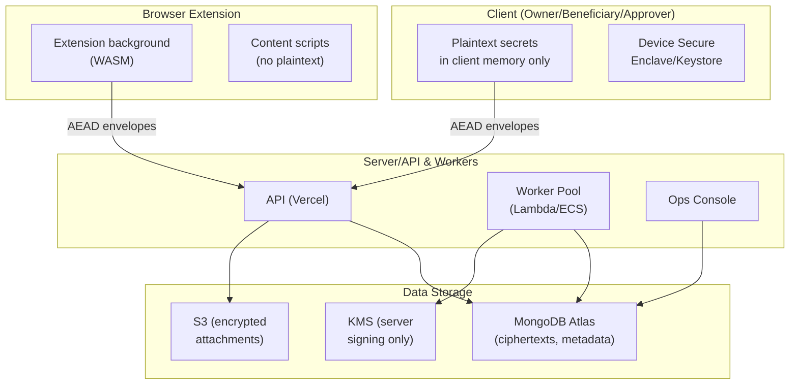

**Trust boundary definitions**

- **Client ↔ Server**: client-side plaintext vs server ciphertext. App-layer AEAD crosses this boundary.
    
- **Server ↔ Storage**: server has access to DB & S3 (ciphertexts); server cannot decrypt user secrets by design.
    
- **Client ↔ Extension**: extension background is more trusted than page content scripts (do not cross secrets to page).
    
- **Server ↔ KMS**: server uses KMS for signing only (no decryption rights for user secrets).
    

---

### 6.2 STRIDE Analysis — per component

Below each STRIDE vector is described with mitigations, detection, and residual risk rating (Low/Medium/High).

#### Component: Client applications (Web, Mobile, Extension)

- **Spoofing**: fake websites or phishing to capture credentials.
    
    - _Mitigations_: OPAQUE (phishing-resistant PAKE), WebAuthn for strong auth, device binding, warning UX on domain mismatches, extension prompts per-host permission.
        
    - _Detection_: monitor unusual login locations & patterns; MFA failure spikes.
        
    - _Residual risk_: Medium (social engineering can still trick users).
        
- **Tampering**: compromised client device or extension builds (supply chain).
    
    - _Mitigations_: signed builds, reproducible builds, CI SCA (dependency scanning), automatic update signing, extension build signing with dual approvals.
        
    - _Detection_: signature mismatch, CI alerts.
        
    - _Residual risk_: Medium (device compromise is still a danger).
        
- **Repudiation**: user denies action.
    
    - _Mitigations_: device-signed actions (device Ed25519, WebAuthn), server-side audit records (hashes and signed release records).
        
    - _Detection_: audit chain verification.
        
    - _Residual risk_: Low.
        
- **Information disclosure**: plaintext exfiltration from device or extension content script.
    
    - _Mitigations_: keep plaintext only in background, content scripts never receive plaintext, auto-clear clipboard, secure enclave.
        
    - _Detection_: telemetry alert on unusual extension permissions or content script messages.
        
    - _Residual risk_: High if device compromised.
        
- **Denial of Service**: user cannot unlock due to device loss.
    
    - _Mitigations_: backup key, social recovery, device emk.
        
    - _Residual risk_: Medium (users must be educated to secure backups).
        
- **Elevation of Privilege**: malicious extension requesting broader permissions.
    
    - _Mitigations_: request-per-host pattern, manual user consent, review on install.
        
    - _Residual risk_: Medium.
        

#### Component: API & Workers (Server)

- **Spoofing**: impersonating API or worker processes.
    
    - _Mitigations_: mutual TLS between internal components (where appropriate), JWT/session security, HMAC for internal webhooks, strict IAM for functions.
        
    - _Residual risk_: Low (if IAM enforced).
        
- **Tampering**: server-side code modified to attempt decryption or exfiltrate keys.
    
    - _Mitigations_: code signing, CI gates, static analysis to ensure no server-side decryption of user MKs; runtime invariant enforcement (deny calls that attempt to decrypt MK/IK); minimal privilege on KMS (sign-only).
        
    - _Detection_: runtime telemetry for any attempt to call forbidden decryption routines; alerts.
        
    - _Residual risk_: Medium (insider risk).
        
- **Repudiation**: server denies performing actions.
    
    - _Mitigations_: KMS-signed release records and anchored audit logs; logs retained in S3 with signed anchors.
        
    - _Residual risk_: Low.
        
- **Information disclosure**: server compromise exposing DB & S3 (ciphertexts).
    
    - _Mitigations_: Zero-Knowledge architecture; server storing ciphertext only; AEAD app-layer prevents forging valid requests without client ephemeral key.
        
    - _Residual risk_: Low for confidentiality, but metadata exposure remains (owners, timestamps).
        
- **Denial of Service**: flooding claim endpoints, causing worker backlog.
    
    - _Mitigations_: rate-limiting, IP throttling, worker autoscale, DLQs with alerts.
        
    - _Residual risk_: Medium.
        
- **Elevation of Privilege**: admin console abuse or compromised admin keys.
    
    - _Mitigations_: Admin API keys IP-restricted, multi-operator approval for destructive ops, auditing of admin actions, 2-person approval workflow for manual review decisions.
        
    - _Residual risk_: Medium-High (if compromise occurs).
        

#### Component: Storage (MongoDB & S3)

- **Spoofing**: fake DB replicas — unlikely due to managed service.
    
    - _Mitigations_: use Atlas with authentication & network restrictions, VPC peering.
        
- **Tampering**: modify ciphertexts or metadata.
    
    - _Mitigations_: audit hash chain (payload_hash), store `payload_hash` and chain in `audit`; daily anchors.
        
    - _Residual risk_: Low (tamper-evidence exists, but cannot prevent modification).
        
- **Information disclosure**: DB or S3 keys leaked.
    
    - _Mitigations_: encrypt attachments client-side; server-side encryption as defense-in-depth; access logs (CloudTrail/Atlas audit).
        
    - _Residual risk_: Low for plaintext, medium for metadata.
        
- **Denial of Service**: delete or corrupt backups.
    
    - _Mitigations_: versioning, retention policy, offsite immutable anchors (Glacier) and multi-account backups.
        
    - _Residual risk_: Medium.
        

#### Component: Browser Extension

- **Spoofing**: malicious extension mimicking official one.
    
    - _Mitigations_: publish under verified account, extension signing, supply chain controls.
        
    - _Residual risk_: Medium.
        
- **Tampering**: extension background compromised or malicious update.
    
    - _Mitigations_: dual approval releases, signed builds, pinned dependency versions, CI signing.
        
    - _Residual risk_: Medium-High (extensions are high-risk).
        
- **Information disclosure**: content script leaking secret.
    
    - _Mitigations_: never send plaintext to content script; do simulated typing only; minimize permissions and ask on demand.
        
    - _Residual risk_: High if not enforced.
        

#### Component: KMS/HSM

- **Spoofing**: mimic KMS — mitigated by cloud provider controls.
    
- **Tampering**: key compromise.
    
    - _Mitigations_: multi-operator rotation, limited sign-permissions, CloudTrail.
        
    - _Residual risk_: High if private key compromised; but KMS signs only audit heads & release records (does not decrypt user secrets).
        
- **Repudiation**: KMS signing prevents server repudiation.
    
- **Information disclosure**: KMS private key leakage — severe; requires emergency rotation and re-anchoring.
    
    - _Mitigations_: strict IAM, operator controls, periodic rotation.
        
    - _Residual risk_: High (operator controls critical).
        

---

### 6.3 Attack Surfaces (detailed list)

1. **Authentication endpoints (OPAQUE flows)**
    
    - Risk: MITM or replay of incomplete flows; phishing.
        
    - Mitigation: OPAQUE, TLS+App-AEAD, session binding to device public keys, `X-Seq` monotonic checks.
        
2. **Invite consumption & claim endpoints**
    
    - Risk: brute-force of claim tokens, mass token abuse.
        
    - Mitigation: HMAC-based tokens, short TTL, rate-limiting, require proof & manual attestation.
        
3. **File uploads (S3 presigned)**
    
    - Risk: attacker uploads malicious content or replacement of uploaded file.
        
    - Mitigation: client-side encryption mandatory, server-side hash validation, short presign TTL.
        
4. **Worker & queue (SQS)**
    
    - Risk: job replay or worker compromise.
        
    - Mitigation: idempotent workers, DLQ, signed job payloads (if necessary), job-level authentication.
        
5. **Admin console & manual review**
    
    - Risk: privilege escalation, unauthorized decision to release.
        
    - Mitigation: multi-operator approval, audit trail, admin operations require two Ed25519 ops signatures or multi-person approval.
        
6. **Browser extension**
    
    - Risk: extension injection or host access abuse.
        
    - Mitigation: background-only decryption, host permission prompts, content scripts never receive plaintext.
        
7. **Client devices**
    
    - Risk: rooted/jailbroken device stealing keys.
        
    - Mitigation: prefer hardware-backed keystores, warn users, require additional step-ups for critical actions.
        
8. **Third-party services (email provider, KYC)**
    
    - Risk: leakage of notifications or KYC data.
        
    - Mitigation: minimize PII in emails, encrypt attachments, contractual SLA & security reviews for KYC providers, client-side encryption for S3 attachments.
        

---

### 6.4 Mapping threats to mitigations (quick reference table)

|Threat|Primary Mitigation|Residual Risk|
|---|--:|---|
|Server DB compromise|ZKA, client-side encryption, no plaintext keys on server|Low (metadata leak persists)|
|TLS termination compromise|App-layer AEAD + per-request ephemeral X25519|Low|
|Credential phishing|OPAQUE + WebAuthn|Medium|
|Device compromise|Secure Enclave + biometric + social recovery|High (if user device fully compromised)|
|Admin compromise|Multi-operator signatures + IP restrictions + audit|Medium-High|
|PQ future adversary|Hybrid KEM (X25519+Kyber)|Low (hybrid reduces risk)|

---

### 6.5 Detection & Monitoring Recommendations

- **Metrics & Alerts**
    
    - `server_decrypt_attempts` (critical) — alert to PagerDuty immediately.
        
    - `aeard_failure_rate` (app-AEAD decrypt fails) — investigate trend.
        
    - `claim_token_failure_rate` — throttle & inspect.
        
    - `unexpected_attestation_count` spikes — suspicious.
        
    - Work queue DLQ increases.
        
- **Logging**
    
    - Audit logs (append-only) for every state change; store `payload_hash` not plaintext.
        
    - Log IPs, User-Agent, and device IDs for sign-off traces; store logs in SIEM with retention.
        
- **Periodic checks**
    
    - Verify audit hash chain validity daily; KMS anchor verification.
        
    - Quarterly pentests & crypto re-audit (esp. if crypto_version changes).
        

---

### 6.6 Incident Response Playbooks (high-level)

**A. Suspected server-side decrypt attempt**

1. Disable release flows (`RELEASES_ENABLED=false`).
    
2. Snapshot DB & S3; preserve logs.
    
3. Forensic collect server images & logs; engage external cryptographer.
    
4. Rotate KMS signing keys (multi-operator).
    
5. Rebuild servers from known-good images; perform audit before re-enable.
    
6. Notify legal & affected users per policies.
    

**B. Mass claim abuse detected**

1. Throttle claim endpoints by IP & user.
    
2. Notify Ops & Security.
    
3. Block offending IPs and require captcha or out-of-band verification for claims on affected policies.
    
4. For affected policies, flag for manual review.
    

**C. KMS compromise suspected**

1. Immediately revoke current KMS key (do multi-operator rotation).
    
2. Mark anchor snapshots from compromised keys and re-anchor with new key.
    
3. Re-issue incident report and legal notifications.
    

---

### 6.7 Residual Risks & Acceptance

- **Device compromise** remains the strongest residual risk — recommend strong user education, encouraging Secure Enclave & WebAuthn, and providing clear backup/recovery flows.
    
- **Human social engineering** of approvers or custodians is a non-cryptographic risk that must be addressed via operational controls (KYC, lawyer involvement, two-person ops approvals).
    
- **KMS private key compromise** is high impact — requires strict operational controls.
    

---
## 7. Ops & Monitoring

This section describes how the **Inheritance Vault** system will be deployed, operated, monitored, and maintained in a secure and resilient manner. It covers deployment topology, environment separation, secrets/configuration handling, observability, backup/restore, incident response, and compliance hooks.

---

### 7.1 Deployment Topology

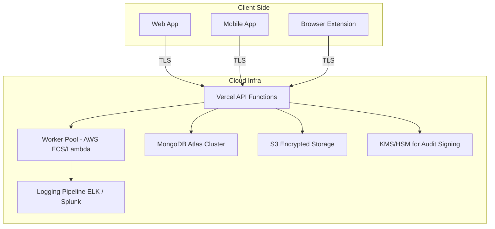

- **Vercel**: Stateless API functions for auth, orchestration, and triggering jobs.
    
- **AWS ECS/Lambda Workers**: Handle background tasks (heartbeats, notifications, periodic verifications).
    
- **MongoDB Atlas**: Primary datastore (encrypted blobs, metadata, user configs).
    
- **S3 (server-side encrypted)**: Large encrypted files (attachments, certificates).
    
- **Logging pipeline (ELK or Splunk)**: Security and operational logs, tamper-proof.
    
- **KMS/HSM**: For signing audit logs, not for user secrets.
    

---

### 7.2 Environment Separation

- **Development** → isolated MongoDB + test S3 bucket, seeded with anonymized data.
    
- **Staging** → mirrors prod infra with reduced scale, used for integration tests and PQ crypto experiments.
    
- **Production** → fully isolated network/VPC, access only via bastion + IAM.
    
- **No cross-environment secrets sharing** → each environment has unique keys, DBs, and buckets.
    

---

### 7.3 Secrets & Configuration Management

- **Config sources**: All secrets (DB URIs, API keys, SMTP creds) injected via **Vercel encrypted env vars + AWS Secrets Manager**.
    
- **Rotation**:
    
    - DB passwords rotated every 90 days.
        
    - API keys rotated quarterly.
        
    - TLS certs auto-rotated via Let’s Encrypt.
        
- **Access policy**:
    
    - Devs never see production secrets.
        
    - Access gated by SSO + MFA + short-lived IAM tokens.
        

---

### 7.4 Observability (Monitoring & Alerting)

- **Metrics** (Prometheus/Grafana stack):
    
    - API latency, error rates, job queue depth, DB query times.
        
    - User activity rates (heartbeat check-ins, logins, inheritance triggers).
        
- **Logs** (ELK/Splunk pipeline):
    
    - Auth attempts, beneficiary claims, document uploads.
        
    - Signed with KMS for immutability.
        
- **Alerting**:
    
    - PagerDuty integration for on-call.
        
    - Critical alerts: DB replication lag, heartbeat worker delays, anomaly in claims.
        
    - Fraud detection alerts: too many failed logins, multiple simultaneous claims.
        

---

### 7.5 Backup & Restore

- **MongoDB Atlas**: Continuous cloud backups with point-in-time restore.
    
- **S3 buckets**: Versioned + cross-region replication.
    
- **Encrypted backups**: Client data already encrypted (XChaCha20 envelope), plus server-level encryption at rest.
    
- **Testing**: Quarterly fire-drills: restore staging from prod backup and validate data integrity.
    

---

### 7.6 Incident Response

- **Runbook Categories**:
    
    1. **Security Incident** (suspected compromise, insider risk, crypto bug).
        
    2. **Availability Incident** (DB outage, worker backlog).
        
    3. **Compliance Incident** (user requests GDPR export/delete).
        
- **Process**:
    
    - Detect anomaly → auto-page on-call.
        
    - Contain → isolate failing service.
        
    - Eradicate → patch/redeploy from trusted base.
        
    - Recover → validate via audit logs & backup verification.
        
    - Postmortem → root cause doc + mitigations.
        

---

### 7.7 Key Management Processes

- **Encryption keys (user)**: Derived client-side (Argon2id + master password), never touch infra.
    
- **Audit signing keys**: Stored in HSM/KMS with multi-operator approvals.
    
- **Rotation**:
    
    - Signing keys rotated annually (with forward-secure chaining).
        
    - PQ crypto experiments staged in parallel for migration readiness.
        

---

### 7.8 Compliance Hooks

- **GDPR**:
    
    - Data minimization: server stores ciphertext only.
        
    - Export → encrypted bundle downloadable by verified users.
        
    - Delete → immediate ciphertext purge + async backup wipe.
        
- **Audit Trails**:
    
    - Every critical event signed by KMS → immutable evidence.
        
    - Logs retained 7 years for legal defensibility.
        
- **PII handling**:
    
    - Legal names, emails, docs → encrypted before storage.
        
    - Only metadata (timestamps, claim IDs) stored plaintext for ops efficiency.
        

---

### Clarification (Why this approach)

- **Vercel + AWS Workers**: Cheaper and faster to start with serverless → scale down costs for small user base. Kubernetes alternative is more complex/costly upfront.
    
- **MongoDB Atlas**: Flexible schema for encrypted blobs and variable inheritance policies. SQL DB would force rigid schema evolution.
    
- **S3 with versioning**: Ensures forensic recovery of documents. Alternatives (GCS, Azure Blob) work too, but S3’s IAM/KMS integration is mature.
    
- **KMS-signed logs**: Better than plaintext logs → prevents insider tampering.
    
- **Environment isolation**: Protects against dev/test mistakes leaking into production.
    
---

## 8. Clarifications — Why & How These Choices

### 8.1 Database Choice — **MongoDB Atlas**

- **Chosen**: MongoDB Atlas (NoSQL, document-oriented).
    
- **Alternatives**:
    
    - **PostgreSQL (SQL)** → Rigid schema, strong consistency.
        
    - **DynamoDB (NoSQL, AWS-managed)** → Great scale, but vendor lock-in.
        
    - **Cassandra** → High throughput, but complex ops.
        
- **Why MongoDB Atlas**:
    
    - Flexible schema → vault entries differ in structure (passwords, wallet keys, inheritance policies). JSON documents are a natural fit.
        
    - Built-in Atlas encryption & replication = strong managed security baseline.
        
    - Global clusters available, easier GDPR compliance.
        
    - Easy scaling (sharding) once user base grows.
        
- **Trade-offs**:
    
    - Less rigid schema validation → requires extra validation layer.
        
    - Not as strong at relational queries compared to SQL → mitigated by embedding inheritance policies directly inside user docs.
        

---

### 8.2 Encryption Algorithm — **XChaCha20-Poly1305**

- **Chosen**: XChaCha20-Poly1305 (AEAD).
    
- **Alternatives**:
    
    - **AES-GCM** → Industry standard, hardware accelerated.
        
    - **ChaCha20-Poly1305 (IETF, 96-bit nonce)** → Already well adopted.
        
- **Why XChaCha20**:
    
    - Extended nonce (192-bit) prevents nonce reuse → critical for client-side encryption with offline users.
        
    - High performance on mobile devices (no AES-NI required).
        
    - Same security level as AES-256-GCM, but more resistant to nonce misuse.
        
- **Trade-offs**:
    
    - Slightly less hardware acceleration support on Intel chips compared to AES-GCM.
        
    - Mitigation → performance still acceptable due to small payload sizes (passwords, keys).
        

---

### 8.3 Password Hashing — **Argon2id**

- **Chosen**: Argon2id (memory-hard KDF).
    
- **Alternatives**:
    
    - **bcrypt** → Old, widely used, but not memory-hard.
        
    - **scrypt** → Memory-hard, but less tunable.
        
    - **PBKDF2** → Slow, CPU-bound, not memory-hard.
        
- **Why Argon2id**:
    
    - Winner of Password Hashing Competition (PHC).
        
    - Memory-hard → expensive for GPU/ASIC brute force.
        
    - Hybrid mode (id) resists side-channels + brute force.
        
    - Highly tunable → can scale cost factors as hardware improves.
        
- **Trade-offs**:
    
    - Newer, less hardware acceleration compared to PBKDF2.
        
    - Mitigation → libsodium & widespread adoption now make it safe for production.
        

---

### 8.4 Post-Quantum Security — **Kyber (CRYSTALS-Kyber KEM)**

- **Chosen**: Kyber (NIST PQC finalist, KEM).
    
- **Alternatives**:
    
    - **Classic McEliece** → Very large keys, impractical.
        
    - **NTRU** → Solid, but less standardized.
        
    - **Dilithium** (signatures) → Complementary, not for KEM.
        
- **Why Kyber**:
    
    - Standardized by NIST (July 2022).
        
    - Compact ciphertexts and keys → usable in constrained devices.
        
    - Already supported in hybrid TLS experiments.
        
    - Future-proof → migration path for long-term encrypted vaults.
        
- **Trade-offs**:
    
    - Higher compute overhead than ECC.
        
    - Mitigation → only used for encrypting master keys, not every user payload.
        

---

### 8.5 Hosting — **Vercel + AWS Workers**

- **Chosen**:
    
    - Vercel → frontend + API edge hosting.
        
    - AWS Lambda/ECS → background workers.
        
- **Alternatives**:
    
    - **Heroku** → Simple, but expensive at scale.
        
    - **Kubernetes (EKS/GKE)** → Scalable, but too complex/costly early on.
        
    - **Bare EC2/GCP VM** → More ops burden.
        
- **Why Vercel + AWS Workers**:
    
    - Vercel → great DX (dev experience), free tier for early users, CDN edge presence.
        
    - Serverless AWS workers → auto-scale for heartbeat jobs, low idle cost.
        
    - Vendor flexibility → can migrate to K8s later without lock-in.
        
- **Trade-offs**:
    
    - Serverless cold starts.
        
    - Mitigation → provision warm pools for latency-sensitive tasks.
        

---

### 8.6 Multi-Factor Authentication (2FA/3FA)

- **Chosen**: Email + password + fingerprint/TOTP/SMS.
    
- **Alternatives**:
    
    - Password-only (weak).
        
    - Hardware keys (FIDO2/U2F).
        
- **Why this combo**:
    
    - Balance between strong security and usability.
        
    - Biometrics convenient for mobile, TOTP works cross-device, SMS as fallback.
        
    - Backup keys/security questions allow recovery.
        
- **Trade-offs**:
    
    - Hardware keys would be stronger, but adoption barrier high for early users.
        
    - Mitigation → can add FIDO2 support later as optional.
        

---

### 8.7 Inheritance Flow (m-of-n, Lawyers, Conflict Resolution)

- **Chosen**: Threshold-based verification (e.g., 2-of-3, 3-of-5 approvals), optional lawyer as tiebreaker.
    
- **Alternatives**:
    
    - Single beneficiary auto-claim (simpler, but risky).
        
    - Fully manual operator-controlled release.
        
- **Why threshold-based flow**:
    
    - More resilient against fraud (collusion harder).
        
    - Flexible → users choose n and m.
        
    - Lawyer optional → balances automation + legal oversight.
        
- **Trade-offs**:
    
    - More complex user experience.
        
    - Mitigation → guided UI setup, default templates (e.g., 2-of-3).
        

---

### 8.8 Logging & Monitoring

- **Chosen**: KMS-signed logs + ELK/Splunk.
    
- **Alternatives**: Plain logs, syslog-only.
    
- **Why KMS-signed logs**:
    
    - Prevents insider tampering.
        
    - Legally defensible in disputes.
        
- **Trade-offs**:
    
    - Slightly higher storage cost.
        
    - Mitigation → use log tiering (hot → cold).
        

---

### 8.9 Backup & Recovery

- **Chosen**: Atlas continuous backup + S3 versioned buckets.
    
- **Alternatives**: Manual snapshots, no versioning.
    
- **Why continuous backup/versioning**:
    
    - Ensures forensic recovery if tampered/deleted.
        
    - Easy rollback of corrupted states.
        
- **Trade-offs**:
    
    - Higher storage usage.
        
    - Mitigation → lifecycle policies (cold archive after 90 days).
        

---

### 8.10 Compliance

- **Chosen**: GDPR-aligned PII handling, encryption-before-storage.
    
- **Alternatives**: Plain storage + encrypt at rest (weaker model).
    
- **Why client-side encryption**:
    
    - Even server operators can’t decrypt user data.
        
    - Minimal liability.
        
- **Trade-offs**:
    
    - No server-side indexing/search.
        
    - Mitigation → metadata-only indexing, client-side search.
        

---

# 9. Appendices

---

## 9.1 Glossary

|Term|Definition|Notes|
|---|---|---|
|**AEAD**|Authenticated Encryption with Associated Data|Ensures both confidentiality and authenticity (we use XChaCha20-Poly1305).|
|**Argon2id**|Password hashing algorithm|Memory-hard, resists brute force, PHC winner.|
|**Beneficiary**|A designated individual/entity who inherits user secrets on death.|Identified by public key + verified identity.|
|**Claim Process**|Workflow where a beneficiary proves user’s death and meets approval threshold.|Requires documents + m-of-n approvals.|
|**DFD**|Data Flow Diagram|Diagram showing flow of data between processes, storage, and boundaries.|
|**ERD**|Entity Relationship Diagram|Visual representation of database schema and relations.|
|**Heartbeat**|Periodic liveness check to ensure user is alive.|If missed beyond buffer, claim process may start.|
|**KEM**|Key Encapsulation Mechanism|Cryptographic primitive used in PQ algorithms (Kyber).|
|**KMS**|Key Management Service|AWS-managed cryptographic key vault used for logs and ops.|
|**M-of-N**|Threshold approval mechanism|e.g., 2 of 3 beneficiaries must approve claim.|
|**PQ (Post-Quantum)**|Cryptography resistant to quantum attacks|Using Kyber KEM for master key wrapping.|
|**STRIDE**|Threat modeling framework (Spoofing, Tampering, Repudiation, Info disclosure, DoS, Elevation).|Applied in Section 6.|
|**ZKP**|Zero-Knowledge Proof|Allows proof of possession/claim without revealing secret.|

---

## 9.2 Future Roadmap

### Phase 1 — MVP (0–6 months)

- Core inheritance app + browser extension.
    
- User registration, vault storage, encryption.
    
- Heartbeat and m-of-n claim flow.
    
- Manual lawyer integration (email + dashboard).
    
- Monitoring + basic compliance (GDPR).
    

### Phase 2 — Scaling (6–18 months)

- Multi-region deployments (Atlas global clusters).
    
- Optional FIDO2 hardware key support for login.
    
- Automated lawyer/legal integration APIs (e.g., law firm APIs).
    
- Hybrid PQ encryption for master keys.
    
- UI/UX improvements for inheritance setup templates.
    

### Phase 3 — Advanced (18–36 months)

- Full PQ migration (Kyber for all key exchange, Dilithium for signatures).
    
- Blockchain-based audit anchor (for transparency, not storage).
    
- Formal verification of heartbeat/claim protocols.
    
- Integrations with password managers, wallet providers, estate planning platforms.
    
- Compliance expansion → SOC2, HIPAA if applicable.
    

---

## 9.3 Legal Considerations

- **Jurisdictional Differences**: Inheritance laws differ widely (e.g., EU vs US vs Asia). Lawyer participation ensures compliance.
    
- **Death Certificate Verification**: Manual review required to prevent fraud. OCR + backend automation can assist but not replace human validation.
    
- **Beneficiary Disputes**: Threshold (m-of-n) + optional lawyer involvement reduce but don’t eliminate conflicts. Team escalation needed for final arbitration.
    
- **Data Ownership**: User maintains full control until death confirmation. Company must not access secrets directly (ensured by client-side encryption).
    
- **Right to be Forgotten**: GDPR compliance — beneficiaries can request removal of their identity data if not involved in any active inheritance case.
    
- **Regulatory Hooks**: Logging with KMS signatures provides tamper-evident audit trails useful in court disputes.
    

---

## 9.4 Final Notes

- The design favors **end-to-end security**: encryption before storage, memory-hard password hashing, PQ readiness.
    
- The **inheritance flow** balances automation (heartbeat triggers, email notifications) with **human oversight** (lawyer approval, manual conflict resolution).
    
- By separating **Clarifications**, the team has a clear rationale for each decision and can adapt if requirements change.
    
- The system is designed for **scalability** (Mongo sharding, serverless workers, Vercel edge hosting) and **compliance** (audit logs, GDPR, PQ roadmap).
    

---
